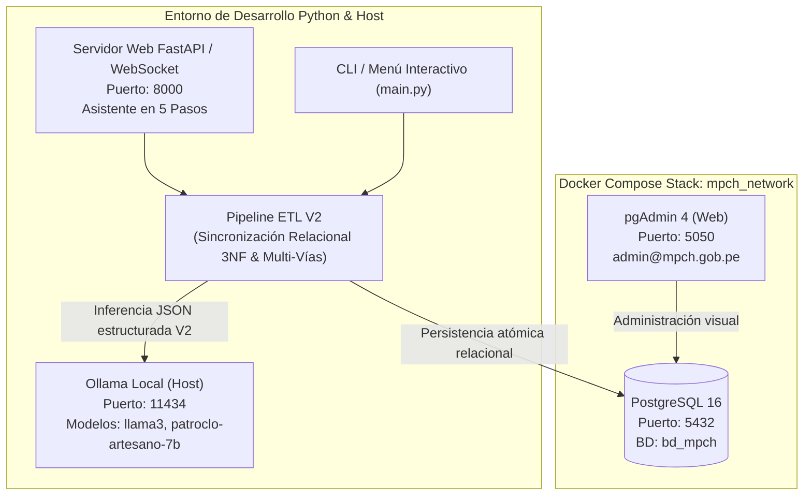

# Guía Integral de Uso y Pruebas del ETL MPCH (Versión 2.0)

Esta guía describe paso a paso cómo desplegar el entorno de la **Versión 2.0**, inicializar la base de datos relacional normalizada (11 tablas con nomenclatura institucional `tb_`), interactuar mediante el **Asistente Web en 5 Pasos** o la consola CLI, y ejecutar la exportación en **JSON**, **Excel** y **CSV**.

---

## 🏛️ Arquitectura del Entorno de Pruebas V2



---

## 🚀 Paso 1: Levantar los Servicios con Docker Compose

1. **Iniciar contenedores:**
   ```bash
   docker compose up -d
   ```
2. **Verificar estado:**
   ```bash
   docker compose ps
   ```
   *Deberás observar `mpch_postgres` y `mpch_pgadmin` en estado saludable (`Up`).*

---

## 🗄️ Paso 2: Crear la Estructura V2 Normalizada en PostgreSQL

Para aplicar el esquema corporativo en Tercera Forma Normal (3NF) con las 11 tablas, claves foráneas, catálogos sembrados y la vista `v_direcciones_v2`:

```bash
docker exec -i mpch_postgres psql -U postgres -d bd_mpch < scripts_data_base/06_crear_estructura_v2_normalizada.sql
```

### Tablas creadas:
1. `tb_tipo_via`: 12 Tipos de vía oficiales (`AVENIDA`, `CALLE`, `JIRON`, etc.).
2. `tb_via`: 2,935 Vías físicas oficiales de Chiclayo.
3. `tb_tipo_zona`: 28 Tipos de zona oficiales (**sin tipo 29; H.U. homologa a Urbanización**).
4. `tb_zona`: 460 Zonas y habilitaciones oficiales de Chiclayo.
5. `tb_direccion`: Entidad de dirección normalizada (`dire_id`, `zona_id`, `dire_referencia`).
6. `tb_direccion_via`: Entidad de vías asociadas, esquinas e intersecciones (`divi_numero`, `divi_orden`).
7. `tb_componente_direccion`: Catálogo de componentes urbanos y rurales (Manzana, Lote, Sublote, Piso, etc.).
8. `tb_contenido_componente_direccion`: Detalle de componentes catastrales por dirección.
9. `tb_tipo_modulo`: Catálogo de dependencias habitacionales y comerciales (Interior, Stand, Dpto, Puerta, etc.).
10. `tb_direccion_tipo_modulo`: Detalle de dependencias interiores por dirección.
11. `tb_xxx`: Tabla de ejemplo o negocio que preserva la dirección original (`xxxx_direccion_original`) y enlaza `dire_id` únicamente al normalizar con éxito.

---

## 🖥️ Paso 3: Asistente Web Interactivo en 5 Pasos (GUI)

Inicia el servidor web interactivo:

```bash
./venv/bin/python main.py ui
```
Ingresa desde tu navegador a: **`http://localhost:8000`**

### Flujo del Asistente (Wizard):
- **Paso 1: Diagnóstico de Conexión:** Comprueba la disponibilidad de PostgreSQL y del motor Ollama.
- **Paso 2: Selección del Modelo de IA:** Detecta dinámicamente los modelos instalados en Ollama (`patroclo-artesano-7b:latest`, `llama3`, etc.) y permite elegir el motor deseado.
- **Paso 3: Selección de Esquema y Tabla:** Muestra los esquemas de la base de datos (`public`, etc.) y sus tablas disponibles (ej. `tb_xxx`, `direcciones_actual`).
- **Paso 4: Mapeo de Columnas:** Vincula de forma asistida la columna de ID, la columna de dirección cruda y las llaves de negocio opcionales.
- **Paso 5: Ejecución y Descarga de Resultados:**
  - Barra de progreso porcentual y medidor de registros/segundo en tiempo real.
  - Consola de eventos vía WebSockets con desglose de vías múltiples, módulos y componentes.
  - **Botones de Descarga en 3 Formatos:**
    - 📄 **Exportar JSON:** Reporte jerárquico V2 con toda la metadata relacional.
    - 📊 **Exportar Excel (XLSX):** Planilla desnormalizada para auditoría en hoja de cálculo.
    - 📑 **Exportar CSV:** Archivo delimitado estándar.
  - Tarjetas de descarga diferenciadas para:
    - **Direcciones Procesadas**
    - **Direcciones Observadas** (con el diagnóstico y motivo técnico emitido por la IA)
    - **Catastro Válido**

---

## 💻 Paso 4: Ejecución por Línea de Comandos (CLI)

También puedes operar el pipeline directamente desde la terminal o mediante el menú TUI interactivo:

```bash
# Menú interactivo en consola:
./venv/bin/python main.py menu

# Ejecución directa por CLI sobre cualquier esquema y tabla:
./venv/bin/python main.py run --schema public --limit 50

# Diagnóstico de salud de la IA en tiempo real:
./venv/bin/python main.py check-ollama
```

---

## 🧪 Paso 5: Ejecución de la Suite de Pruebas Automatizadas

El proyecto incluye **135+ pruebas unitarias automatizadas** que validan todas las reglas de negocio de la Versión 2.0:

```bash
./venv/bin/pytest tests/ -k "not ollama"
```

### Cobertura de Pruebas:
- **`tests/test_v2_normalization_structure.py`**:
  - Detección y modelado de múltiples vías en esquinas e intersecciones (`tb_direccion_via`).
  - Mapeo estricto de `H.U.` hacia `URBANIZACIÓN` (tipo 6) respetando los 28 tipos de zona oficiales.
  - Resolución con máxima coherencia para zonas desalineadas (ej. *9 de Octubre* $\rightarrow$ *UPIS 9 de Octubre*).
  - Extracción y almacenamiento de módulos inmobiliarios (`STAND`, `INTERIOR`, `DPTO`, `PUERTA`, `BLOCK`) en `tb_direccion_tipo_modulo`.
  - Extracción de componentes catastrales urbanos y rurales en `tb_contenido_componente_direccion`.
  - Confinamiento estricto de referencias a hitos espaciales y comerciales (Mall Aventura, Real Plaza, Frente al Parque).
  - Exportación estructurada en formato JSON V2.
  - Persistencia atómica relacional y actualización de `tb_xxx`.
- **`tests/test_address_parsing_heuristics.py`**: Casos de contingencia y heurísticas ante fallas de red.
- **`tests/test_normalization_quality_guarantees.py`**: Protección de fechas viales y desacoplamiento numérico.
- **`tests/test_pipeline_structure.py`**: Sincronización dinámica de catálogos y trazabilidad de motores.
- **`tests/test_ui_server.py`**: Endpoints de API REST, exportaciones JSON/Excel/CSV y WebSockets.

---

## 📈 Consultas SQL de Validación en pgAdmin

Para auditar los resultados normalizados en PostgreSQL (`http://localhost:5050`):

```sql
-- 1. Consultar la vista consolidada V2:
SELECT * FROM public.v_direcciones_v2 LIMIT 10;

-- 2. Consultar registros normalizados en la tabla de negocio:
SELECT 
    x.xxxx_id,
    x.xxxx_direccion_original,
    x.xxxx_es_procesado,
    d.dire_id,
    d.dire_referencia,
    z.zona_nombre
FROM public.tb_xxx x
JOIN public.tb_direccion d ON x.dire_id = d.dire_id
LEFT JOIN public.tb_zona z ON d.zona_id = z.zona_id
WHERE x.xxxx_es_procesado = TRUE;

-- 3. Consultar las vías asociadas a cada dirección (esquinas):
SELECT 
    dv.dire_id,
    dv.divi_orden,
    v.via_nombre,
    dv.divi_numero
FROM public.tb_direccion_via dv
JOIN public.tb_via v ON dv.via_id = v.via_id
ORDER BY dv.dire_id, dv.divi_orden;

-- 4. Consultar los módulos interiores por dirección:
SELECT 
    dtm.dire_id,
    tm.timo_nombre,
    dtm.ditm_nombre
FROM public.tb_direccion_tipo_modulo dtm
JOIN public.tb_tipo_modulo tm ON dtm.timo_id = tm.timo_id
ORDER BY dtm.dire_id;

-- 5. Consultar los registros observados con su motivo de IA:
SELECT 
    xxxx_id,
    xxxx_direccion_original,
    xxxx_observacion_ia
FROM public.tb_xxx
WHERE xxxx_es_procesado = FALSE;
```
