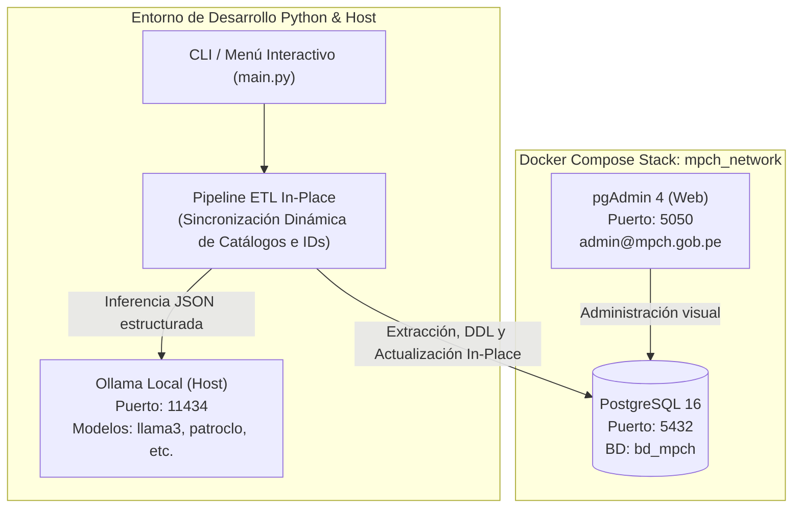

# Guía Integral de Uso y Pruebas del ETL MPCH

Esta guía describe paso a paso cómo desplegar el entorno con **Docker Compose** (PostgreSQL y pgAdmin 4), cómo conectar el modelo local de Inteligencia Artificial (Ollama) y cómo probar los diferentes escenarios y esquemas con el pipeline ETL **In-Place** de normalización de direcciones.

---

## 🏛️ Arquitectura del Entorno de Pruebas



---

## 🚀 Paso 1: Levantar los Servicios con Docker Compose

El archivo [`docker-compose.yml`](file:///home/victorchung/IdeaProjects/ETL_MIGRACION_MPCH/docker-compose.yml) define los contenedores necesarios con volúmenes persistentes y red compartida:

1. **Iniciar los servicios en segundo plano:**
   ```bash
   docker compose up -d
   ```

2. **Verificar que los contenedores estén activos (`Up` o `healthy`):**
   ```bash
   docker compose ps
   ```
   *Deberás ver `mpch_postgres` y `mpch_pgadmin` corriendo.*

3. **Detener los servicios cuando termines las pruebas:**
   ```bash
   docker compose down
   ```

> [!NOTE]
> Al iniciar por primera vez, PostgreSQL ejecuta automáticamente el script [`docker/initdb/01_init.sql`](file:///home/victorchung/IdeaProjects/ETL_MIGRACION_MPCH/docker/initdb/01_init.sql), el cual:
> - Configura `public.direcciones_actual` con la data importada desde `/data_import/Direcciones_.csv`.
> - **No crea tablas categorizables en `public`**, dejando que el ETL las cree dinámicamente in-place.
> - Configura los esquemas de prueba: `schema_solo_tabla`, `schema_cat_vacios` y `schema_cat_parciales`.

---

## 🌐 Paso 2: Acceso y Monitoreo Visual con pgAdmin 4

pgAdmin 4 permite inspeccionar visualmente todos los esquemas, tablas y registros en tiempo real:

1. Abre tu navegador web e ingresa a: **`http://localhost:5050`**
2. Inicia sesión con las credenciales:
   - **Correo electrónico:** `admin@mpch.gob.pe`
   - **Contraseña:** `admin`
3. En el panel izquierdo (*Servers*), haz clic en el servidor **`PostgreSQL MPCH (bd_mpch)`** preconfigurado.
4. Introduce la contraseña de base de datos cuando la solicite: **`postgres`**.
5. En `Databases` > `bd_mpch` > `Schemas`, observarás los 4 esquemas disponibles:
   - **`public`**: Tabla `direcciones_actual` con los registros importados del CSV.
   - **`schema_solo_tabla`**: Tabla `direcciones_actual` con 5 registros muestra (sin catálogos).
   - **`schema_cat_vacios`**: Tabla `direcciones_actual` + catálogos vacíos sin columna `abreviatura`.
   - **`schema_cat_parciales`**: Tabla `direcciones_actual` + catálogos con 3 registros pre-ocupados.

---

## 🦙 Paso 3: Diagnóstico y Verificación en Vivo de la IA (Ollama)

Dado que la calidad semántica depende del modelo de IA (`patroclo-artesano-7b:latest` o `llama3`), el sistema incluye una prueba de fuego de inferencia en tiempo real:

1. **Asegúrate de que Ollama esté en ejecución en tu máquina o servidor remoto:**
   ```bash
   ollama list
   ```

2. **Ejecutar el diagnóstico en vivo desde el proyecto (`check-ollama`):**
   ```bash
   ./venv/bin/python main.py check-ollama
   ```
   *Esta acción realiza lo siguiente:*
   - Verifica la disponibilidad HTTP con el servidor en `OLLAMA_BASE_URL`.
   - Consulta el catálogo de modelos instalados y valida que el modelo seleccionado esté presente.
   - **Envía una dirección de prueba real** (`CALLE BALTA N° 520 - CHICLAYO`) y mide la **latencia de inferencia en segundos**.
   - Muestra una tabla con el desglose exacto extraído por el modelo (`tipo_via`, `nom_via`, `num_via`, etc.).

3. **Modo Estricto con bandera `--require-ai`:**
   Si deseas asegurar que ningún registro se procese con heurística si la IA estuviera apagada o colgada, añade `--require-ai`:
   ```bash
   ./venv/bin/python main.py run --schema public --limit 10 --require-ai
   ```
   *Si el modelo no está levantado en memoria, el ETL abortará inmediatamente informando la causa del error sin tocar la base de datos.*


---

## 📋 Paso 4: Casos de Prueba del ETL según Esquema

El ETL In-Place cuenta con inteligencia integrada para adaptarse a cualquier estado de la base de datos sin intervención manual.

---

### Caso 1: Esquema con Solo Tabla de Direcciones (`schema_solo_tabla`)

* **Escenario Inicial:** Únicamente existe `direcciones_actual` (con casos retadores como `Ca. 7 de enero N129`, `AV. SALAVERRY 450 URB. COLIBRI` y referencias como `cerca al senati`). No existen tablas categorizables ni maestras físicas.
* **Comportamiento del ETL:**
  1. Detecta que no existen las tablas categorizables (`tipos_via`, `tipos_zona`) ni las maestras físicas (`vias`, `zonas`).
  2. Crea las tablas `tipos_via` y `tipos_zona` y siembra los 12 tipos de vía y 28 tipos de zona oficiales.
  3. Crea las tablas maestras `vias` y `zonas` y siembra las **3,024 vías físicas** y **461 habilitaciones urbanas** oficiales de Chiclayo.
  4. Agrega in-place las 11 columnas normalizadas (`id_via`, `tipo_via`, `nom_via`, `num_via`, `id_zona`, `tipo_zona`, `nom_zona`, `manzana`, `lote`, `slote`, `referencia`) a `direcciones_actual` y crea las Claves Foráneas.
  5. Extrae y normaliza las direcciones con IA y heurística:
     - En `Ca. 7 de enero N129`: Asocia `id_via = 2279` (*7 DE ENERO SUR*), `nom_via = '7 DE ENERO'` y extrae limpiamente `num_via = '129'`.
     - En `AV. SALAVERRY 450 URB. COLIBRI`: Asocia `id_via = 2862` (*FELIPE SANTIAGO SALAVERRY*), `num_via = '450'` e `id_zona = 461` (*COLIBRI*).
     - En `Calle trindiad 128, Urbanizacion el paraiso, cerca al senati`: Asocia `id_zona = 18` (*EL PARAÍSO*) y extrae `referencia = 'CERCA AL SENATI'`.

**Comando de ejecución:**
```bash
./venv/bin/python main.py run --schema schema_solo_tabla --limit 10
```

**Verificación en SQL (pgAdmin o psql):**
```sql
SELECT id_licencia, emp_direccion, id_via, tipo_via, nom_via, num_via, id_zona, tipo_zona, nom_zona, referencia
FROM schema_solo_tabla.direcciones_actual
ORDER BY id_licencia ASC;

-- Verificar catálogos maestros físicos y tipológicos:
SELECT id_via, codigo_via, nom_via, clasificacion_vial FROM schema_solo_tabla.vias WHERE id_via IN (2279, 2862);
SELECT id_zona, codigo_zona, nom_zona FROM schema_solo_tabla.zonas WHERE id_zona IN (18, 461);
SELECT * FROM schema_solo_tabla.tipos_via ORDER BY id_tipo_via ASC;
SELECT * FROM schema_solo_tabla.tipos_zona ORDER BY id_tipo_zona ASC;
```

---

### Caso 2: Esquema con Catálogos Vacíos y sin `abreviatura` (`schema_cat_vacios`)

* **Escenario Inicial:** Las tablas `tipos_via` y `tipos_zona` existen pero están vacías (0 registros) y **no tienen la columna `abreviatura`**.
* **Comportamiento del ETL:**
  1. Detecta que las tablas ya existen en el esquema.
  2. Examina las columnas y detecta que falta `abreviatura`.
  3. Ejecuta `ALTER TABLE ... ADD COLUMN IF NOT EXISTS abreviatura VARCHAR(20)`.
  4. Al no haber registros existentes, siembra los 12 tipos de vía y 28 tipos de zona.
  5. Crea y siembra las tablas maestras `vias` (3,024 calles) y `zonas` (461 sectores).
  6. Agrega las 11 columnas in-place a `direcciones_actual` y actualiza los registros vinculando sus IDs físicos y tipológicos.

**Comando de ejecución:**
```bash
./venv/bin/python main.py run --schema schema_cat_vacios --limit 5
```

**Verificación en SQL:**
```sql
-- Verificar que se añadió la columna abreviatura y los datos completos:
SELECT id_tipo_via, nombre_tipo_via, abreviatura FROM schema_cat_vacios.tipos_via;
SELECT id_licencia, tipo_via, nom_via, num_via, tipo_zona, nom_zona 
FROM schema_cat_vacios.direcciones_actual;
```

---

### Caso 3: Esquema con Registros Parciales y Estandarización Canónica (`schema_cat_parciales`)

* **Escenario Inicial:** Las tablas maestras cuentan con registros pre-existentes cuyos IDs no coinciden con el estándar JSON:
  - `tipos_via`: `1='CALLE'`, `2='AVENIDA'`, `3='JIRON'`. *(¡CALLE es 1 y AVENIDA es 2, cuando el estándar canónico es AVENIDA=1 y CALLE=2!)*
  - `tipos_zona`: `1='URBANIZACION'`, `2='PUEBLO JOVEN'`, `3='ASENTAMIENTO HUMANO'`. *(¡URB es 1 cuando canónicamente es 6!)*
* **Comportamiento del ETL:**
  1. Detecta los registros y **estandariza sus IDs a la estructura canónica del JSON** para unificar todos los esquemas (`AVENIDA=1, CALLE=2` y `ASENTAMIENTO HUMANO=1, PUEBLO JOVEN=5, URBANIZACION=6`).
  2. **Reasigna atómicamente las relaciones** en la tabla `direcciones_actual` si ya contaban con valores previos de `tipo_via` o `tipo_zona`, manteniendo la consistencia de los datos históricos.
  3. Inserta las 9 vías y 25 zonas restantes del catálogo JSON con sus IDs canónicos exactos (totalizando 12 vías y 28 zonas).
  4. Sincroniza `CatalogMatcher` bajo el estándar oficial canónico unificado.
  5. Actualiza las direcciones en sitio asociando las llaves foráneas estándar.

**Comando de ejecución:**
```bash
./venv/bin/python main.py run --schema schema_cat_parciales --limit 5
```

**Verificación en SQL:**
```sql
-- Verificar que ahora AVENIDA es 1 y CALLE es 2, cumpliendo el estándar canónico JSON:
SELECT id_tipo_via, nombre_tipo_via, abreviatura 
FROM schema_cat_parciales.tipos_via 
ORDER BY id_tipo_via ASC;

-- Verificar que URBANIZACION es 6, PUEBLO JOVEN es 5 y ASENTAMIENTO HUMANO es 1:
SELECT id_tipo_zona, nombre_tipo_zona, abreviatura 
FROM schema_cat_parciales.tipos_zona 
ORDER BY id_tipo_zona ASC;

-- Verificar la normalización consistente de direcciones:
SELECT id_licencia, emp_direccion, tipo_via, nom_via, num_via, tipo_zona, nom_zona, referencia 
FROM schema_cat_parciales.direcciones_actual;
```

---

### Caso 4: Esquema Principal de Producción (`public`)

* **Escenario Inicial:** Tabla `public.direcciones_actual` importada con los miles de registros del archivo CSV, sin tablas de catálogos pre-existentes.
* **Comportamiento del ETL:** Inicializa los catálogos en `public`, prepara las columnas in-place y ejecuta la normalización de la data real.

**Comando de prueba (ejecutando sobre los primeros 10 registros):**
```bash
./venv/bin/python main.py run --schema public --limit 10
```

---

## 🔄 Reiniciar o Regenerar los Esquemas de Prueba

Si deseas limpiar o reiniciar los esquemas de prueba para volver a realizar ensayos desde cero, puedes ejecutar el script SQL provisto:

```bash
# Ejecutar directamente contra el contenedor PostgreSQL:
docker exec -i mpch_postgres psql -U postgres -d bd_mpch < scripts_data_base/04_crear_schemas_de_prueba.sql
```

O abrir y ejecutar el archivo [`scripts_data_base/04_crear_schemas_de_prueba.sql`](file:///home/victorchung/IdeaProjects/ETL_MIGRACION_MPCH/scripts_data_base/04_crear_schemas_de_prueba.sql) desde la herramienta Query Tool de pgAdmin 4.

---

## 🖥️ Paso 5: Menú Interactivo Visual (Consola TUI)

Para operar de forma interactiva y cambiar de esquema cómodamente:

```bash
./venv/bin/python main.py menu
```

Se desplegará la interfaz:

```text
=================================================================
      SISTEMA ETL DE MIGRACIÓN DE DIRECCIONES - MPCH
      Normalización Catastral asistida con IA Local (Ollama)
      📍 Esquema Activo: [public] | BD: [bd_mpch]
=================================================================
1. 📊 Ver Configuración Activa (.env / Schemas / Tablas)
2. 🩺 Diagnóstico de Conexiones (PostgreSQL y Ollama)
3. ⚡ Ejecutar ETL In-Place en [public] (Conserva IDs y catálogos)
4. 🔄 Cambiar Esquema Activo de Trabajo (public, schema_solo_tabla, etc.)
5. 🤖 Probar Inferencia de Dirección con Ollama
6. 📚 Gestionar Catálogos y Diccionarios (Vías y Zonas en JSON)
0. 🚪 Salir
-----------------------------------------------------------------
Selecciona una opción [3]: 
```

- Con la opción **4**, puedes escribir el nombre de cualquiera de los esquemas (`schema_solo_tabla`, `schema_cat_vacios`, `schema_cat_parciales`).
- Con la opción **3**, el ETL se ejecutará directamente sobre el esquema seleccionado.
- Con la opción **6**, puedes listar o agregar nuevas zonas (ej. pasar de 28 a 32 zonas) o vías sin tocar código fuente.

---

## ➕ Paso 6: Agregar Nuevas Zonas o Vías Dinámicamente

Si el catálogo de zonas de la municipalidad se amplía (por ejemplo, sumando 4 nuevas zonas para llegar a 32):

1. **Ejecuta el comando CLI para agregar cada una:**
   ```bash
   ./venv/bin/python main.py catalog add-zona --nombre "PARQUE INDUSTRIAL" --abreviatura "P.I." --sinonimos "PARQUE INDUSTRIAL,P.I.,PARQ.IND."
   ```
2. **O agrégala desde el menú interactivo con la opción 6.**
3. **Al ejecutar el ETL (`python main.py run`):**
   - El sistema detectará que la base de datos tiene 28 registros y el catálogo 29 (o 32).
   - Insertará las nuevas zonas con IDs no colisionantes en el esquema activo.
   - Sincronizará las expresiones regulares, el prompt del LLM y los diccionarios en memoria.

---

## 🧪 Paso 7: Ejecución de la Suite de Pruebas Unitarias

Para garantizar la robustez del sistema y verificar todas las condiciones de borde:

```bash
./venv/bin/pytest tests/
```

*Resultado esperado: 41 pruebas unitarias exitosas (100% pasando).*


