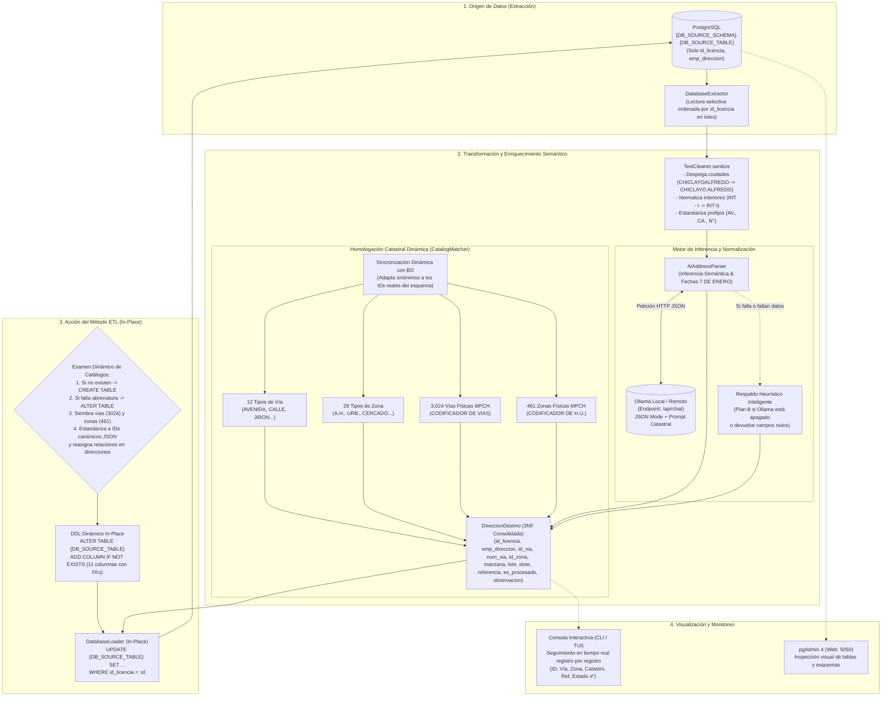

# ETL_DIRECCIONES - Sistema ETL de Migración y Normalización de Direcciones MPCH

Arquitectura y motor en Python para el proceso de extracción, enriquecimiento semántico con **IA local (Ollama)** y carga (ETL) de direcciones para la **Municipalidad Provincial de Chiclayo (MPCH)** en PostgreSQL.

Diseñado con soporte para esquemas, tablas y columnas dinámicas vía `.env`, preservación estricta de IDs originales y un método oficial único: **In-Place (Evolución de tabla en producción conservando IDs)**. Integra la verificación y creación automática de las tablas categorizables (`tipos_via` y `tipos_zona`) y de las tablas maestras terciarias de Chiclayo (`vias` con 3,024 calles físicas y `zonas` con 461 habilitaciones urbanas), detección de columnas faltantes como `abreviatura`, vinculación de llaves foráneas (`id_via`, `id_zona`, `tipo_via`, `tipo_zona`) y extracción de campo `referencia`.

---

## 📐 Diagrama de Arquitectura y Flujo de Datos (ETL)

El siguiente diagrama detalla cómo fluyen los datos a través de los componentes del sistema, desde la extracción selectiva hasta la persistencia y visualización:



### 🔍 Explicación del Flujo Real de Datos:

1. **Examen y Sincronización Inteligente de Catálogos:**
   - Al iniciar la acción del ETL, el sistema examina las tablas maestras en el esquema activo:
     - **Tablas Tipológicas (`tipos_via` y `tipos_zona`):**
       - Si no existen: Las crea y siembra con los 12 tipos de vía y 28 tipos de zona oficiales.
       - Si existen pero falta la columna `abreviatura`: Ejecuta `ALTER TABLE ... ADD COLUMN IF NOT EXISTS abreviatura VARCHAR(20)`.
       - Si ya contienen registros: Estandariza los registros al orden canónico propuesto en el JSON (`AVENIDA=1, CALLE=2`), reasigna atómicamente las relaciones foráneas en la tabla de direcciones y completa los tipos faltantes.
     - **Tablas Maestras Físicas de Chiclayo (`vias` y `zonas`):**
       - Crea y siembra la tabla `vias` con las **3,024 calles oficiales** de Chiclayo (`CODIFICADOR DE VIAS`), con su clasificación vial y jurisdicción.
       - Crea y siembra la tabla `zonas` con las **461 habilitaciones urbanas** oficiales (`CODIFICADOR DE HABILITACIONES URBANAS`), incluyendo sectores catastrales y urbanizaciones como *Colibrí*.
   - **Sincronización Dinámica de `CatalogMatcher`:** Sincroniza en memoria los mapeos contra la base de datos real del esquema para garantizar que las llaves foráneas (`tipo_via`, `tipo_zona`, `id_via`, `id_zona`) coincidan con los IDs exactos de ese esquema.
2. **Preparación In-Place de la Tabla:**
   - Se asegura la existencia de las 11 columnas normalizadas (`id_via`, `tipo_via`, `nom_via`, `num_via`, `id_zona`, `tipo_zona`, `nom_zona`, `manzana`, `lote`, `slote`, `referencia`) en la tabla actual (`direcciones_actual`) mediante `ALTER TABLE ... ADD COLUMN IF NOT EXISTS`, creando las claves foráneas correspondientes y conservando intactos todos los registros e IDs originales.
3. **Extracción Selectiva (E):**
   - El extractor lee ordenadamente las columnas (`id_licencia` y `emp_direccion`) de la tabla emisora en lotes configurables.
4. **Pre-limpieza Léxica (`TextCleaner`):**
   - Sanea caracteres especiales, despega ciudades fusionadas (ej. `CHICLAYOALFREDO` $\rightarrow$ `CHICLAYO ALFREDO`), unifica interiores (`INT - I` $\rightarrow$ `INT-I`) y estandariza prefijos.
5. **Inferencia con IA Local (`AIAddressParser` + Ollama):**
   - Envía el texto a Ollama vía API REST (`/api/chat`) con el modelo configurado (`llama3`, `patroclo-artesano-7b`).
   - **Protección de Calles con Fechas/Números:** Detecta calles como *7 de enero*, *8 de octubre*, *9 de octubre*, *28 de julio* para que el número del nombre nunca sea interpretado erróneamente como número municipal (`num_via`).
   - Si Ollama no respondiera, entra en acción la contingencia heurística para extraer vías, nombres, números, zonas y referencias.
6. **Homologación Relacional Dinámica (`CatalogMatcher`):**
   - Asocia el registro con los IDs numéricos exactos de las tablas maestras del esquema activo (`id_via`, `tipo_via`, `id_zona`, `tipo_zona`).
7. **Carga y Persistencia In-Place (L):**
   - Actualiza la fila en la misma tabla (`UPDATE direcciones_actual SET ... WHERE id_licencia = :id`), garantizando que los IDs permanezcan idénticos y sin pérdida de datos históricos.
8. **Auditoría Visual en Tiempo Real:**
   - Cada registro muestra inmediatamente en consola el desglose estructurado y la confirmación de persistencia con sus IDs de vía y zona.

---

## 🗄️ Esquemas de Prueba Preconfigurados

La base de datos se inicializa con 4 esquemas para evaluar todos los casos posibles del ETL:

| Esquema | Contenido Inicial | Caso de Prueba Validado |
| :--- | :--- | :--- |
| **`public`** | Únicamente `direcciones_actual` (importada de CSV). Sin catálogos. | Caso estándar de producción: creación completa de catálogos, siembra de vías/zonas y migración in-place. |
| **`schema_solo_tabla`** | Únicamente `direcciones_actual` (8 registros de prueba). Sin catálogos. | Creación desde cero de `tipos_via`, `tipos_zona`, `vias` (3,024) y `zonas` (461) y prueba de casos especiales. |
| **`schema_cat_vacios`** | `direcciones_actual` + catálogos con 0 registros y **sin columna `abreviatura`**. | Detección de columna faltante (`ALTER TABLE`), agregado de `abreviatura`, siembra completa y resolución de vías. |
| **`schema_cat_parciales`** | `direcciones_actual` + catálogos con **3 registros desalineados** (CALLE=1, AVENIDA=2, JIRON=3). | Estandarización a IDs canónicos JSON, reasignación atómica de relaciones en direcciones, siembra de vías y zonas. |

> [!TIP]
> Puedes regenerar o reiniciar estos 4 esquemas en cualquier momento ejecutando el script [`scripts_data_base/04_crear_schemas_de_prueba.sql`](file:///home/victorchung/IdeaProjects/ETL_MIGRACION_MPCH/scripts_data_base/04_crear_schemas_de_prueba.sql).

---

## 📸 Catálogos Oficiales Integrados

Conforme a las directivas catastrales de la Municipalidad Provincial de Chiclayo:
- **12 Tipos de Vía:** `AVENIDA (1)`, `CALLE (2)`, `JIRON (3)`, `PASAJE (4)`, `ALAMEDA (5)`, `CARRETERA (6)`, `PROLONGACION (7)`, `PASEO (8)`, `MALECON (9)`, `CAMINO (10)`, `PLAZA (11)`, `PLAZUELA (12)`.
- **28 Tipos de Zona:** `ASENTAMIENTO HUMANO (1)`, `AGRUPACION (2)`, `CONJUNTO HABITACIONAL (3)`, `CONJUNTO RESIDENCIAL (4)`, `PUEBLO JOVEN (5)`, `URBANIZACION (6)`, `URBANIZACION POPULAR (7)`, `CERCADO (8)`, ..., hasta 28.
- **3,024 Vías Físicas de Chiclayo (`vias`):** Digitalizadas del catálogo oficial MPCH con código de vía, tipo de vía, nombre oficial, clasificación vial (Arterial, Colectora, Local) y jurisdicción.
- **461 Zonas Físicas / Habilitaciones Urbanas (`zonas`):** Digitalizadas del codificador de habilitaciones urbanas MPCH con código de zona, tipo de zona, nombre oficial y sector catastral.
- **Estructura Normalizada In-Place:** `id_licencia`, `id_via`, `tipo_via`, `nom_via`, `num_via`, `id_zona`, `tipo_zona`, `nom_zona`, `manzana`, `lote`, `slote`, `referencia`.

---

## 📁 Estructura del Proyecto

```text
ETL_MIGRACION_MPCH/
├── src/                                  # Código fuente en Python
│   ├── config/                           # Configuración y variables de entorno
│   │   ├── settings.py                   # Pydantic BaseSettings (.env dinámico)
│   │   └── logging_config.py             # Setup de logs estructurados
│   ├── models/                           # Entidades y esquemas de datos
│   │   ├── direccion_origen.py           # Modelo origen (conserva ID y dirección cruda)
│   │   ├── direccion_destino.py          # Modelo normalizado (id_via, id_zona, vías, zonas, mz, lt, ref)
│   │   ├── catalogos.py                  # Modelos de 'tipos_via' y 'tipos_zona'
│   │   └── llm_schemas.py                # Schema JSON validado para Ollama
│   ├── catalogs/                         # Capa desacoplada de datos maestros y diccionarios
│   │   ├── tipos_via.json                # 12 Vías oficiales, abreviaturas, sinónimos y regex
│   │   ├── tipos_zona.json               # 28 Zonas oficiales, abreviaturas, sinónimos y regex
│   │   ├── vias_chiclayo.json            # 3,024 Vías físicas oficiales de Chiclayo
│   │   ├── zonas_chiclayo.json           # 461 Habilitaciones urbanas oficiales de Chiclayo
│   │   └── catalog_manager.py            # Gestor dinámico de carga, agregación y sincronización
│   ├── services/                         # Conectores externos
│   │   ├── db_service.py                 # PostgreSQL: DDL dinámico, esquemas, catálogos y vías/zonas
│   │   └── ollama_service.py             # Ollama: healthcheck, tags e inferencia JSON
│   ├── extractors/                       # Extracción (E)
│   │   ├── base_extractor.py             # Interfaz abstracta
│   │   └── db_extractor.py               # Extracción selectiva de 2 columnas
│   ├── transformers/                     # Transformación y Enriquecimiento (T)
│   │   ├── base_transformer.py           # Interfaz abstracta
│   │   ├── text_cleaner.py               # Limpieza léxica y normalización
│   │   ├── catalog_matcher.py            # Homologación y sincronización dinámica con BD (tipos, vías, zonas)
│   │   ├── ai_parser.py                  # Inferencia semántica asistida por Ollama y fechas viales
│   │   └── pipeline_transformer.py       # Orquestador del flujo de transformación
│   ├── loaders/                          # Carga y Persistencia (L)
│   │   ├── base_loader.py                # Interfaz abstracta
│   │   └── db_loader.py                  # Persistencia In-Place conservando IDs originales
│   ├── pipelines/                        # Orquestación del Pipeline
│   │   └── etl_pipeline.py               # Pipeline In-Place con examen automático de catálogos y vías
│   ├── utils/                            # Utilidades
│   │   └── prompts.py                    # Prompts Few-Shot con catálogo oficial de Chiclayo
│   └── cli.py                            # Menú interactivo visual (Rich) y comandos CLI
├── scripts_data_base/                    # Scripts DDL para PostgreSQL
│   ├── 01_crear_catalogos_vias_y_zonas.sql # Creación y sembrado de 12 vías y 28 zonas
│   ├── 02_crear_tabla_destino_normalizada.sql # Tabla receptora con FKs
│   ├── 03_alter_tabla_origen_in_place.sql # Alter dinámico de tabla existente (incluye id_via, id_zona, ref)
│   ├── 04_crear_schemas_de_prueba.sql    # Inicializador de los esquemas de prueba
│   ├── 05_crear_tablas_maestras_vias_y_zonas.sql # DDL de tablas vias (3024) y zonas (461)
│   ├── scripts_data_actual.sql           # Script legacy
│   └── scripts_data_etl_new.sql          # Script consolidado
├── tests/                                # Suite de pruebas unitarias
├── data_import/                          # Archivos CSV para importación inicial en Docker
│   └── Direcciones_.csv                  # Archivo de direcciones origen
├── docs/                                 # Documentación y codificadores oficiales MPCH
│   ├── DIAGRAMA_BASE_DE_DATOS.md         # Diagrama ER 3NF, diccionario de datos y SQL
│   └── cod_vias_y_habilitaciones_urbanas/ # Excels originales con 3,024 vías y 461 H.U.
├── .env.example                          # Plantilla completa de variables de entorno
├── .env                                  # Archivo de variables de entorno activo
├── requirements.txt                      # Dependencias del proyecto
├── main.py                               # Punto de entrada principal con auto-loader de venv
├── docker-compose.yml                    # Stack Docker (PostgreSQL 16, pgAdmin 4)
├── GUIA_USO_Y_PRUEBAS.md                 # Guía paso a paso de pruebas y casos de uso
└── README.md                             # Documentación del sistema
```

---

## ⚙️ Configuración Dinámica (`.env`)

No es necesario modificar el código Python para cambiar nombres de esquemas, tablas o columnas:

```env
# Conexión General
DB_HOST=localhost
DB_PORT=5432
DB_NAME=bd_mpch
DB_USER=postgres
DB_PASSWORD=postgres

# Esquema y Tabla de Direcciones a Procesar (In-Place)
DB_SCHEMA=public
DB_TABLE=direcciones_actual
DB_ID_COL=id_licencia
DB_DIR_COL=emp_direccion

# Tablas Maestras Categorizables (En el mismo esquema)
DB_TABLE_TIPO_VIA=tipos_via
DB_TABLE_TIPO_ZONA=tipos_zona

# Nombres Dinámicos de Columnas Normalizadas (Agregadas In-Place)
COL_TIPO_VIA=tipo_via
COL_NOM_VIA=nom_via
COL_NUM_VIA=num_via
COL_TIPO_ZONA=tipo_zona
COL_NOM_ZONA=nom_zona
COL_MANZANA=manzana
COL_LOTE=lote
COL_SLOTE=slote
COL_REFERENCIA=referencia

# Ollama Local o Remoto
OLLAMA_BASE_URL=http://localhost:11434
OLLAMA_MODEL=llama3
OLLAMA_TIMEOUT=60

# Método ETL Oficial Único: in_place (Conserva IDs y estructura)
ETL_MODE=in_place
ETL_BATCH_SIZE=50
```

---

## 🖥️ Interfaz de Consola Interactiva (Menú Visual)

Ejecuta sin argumentos o con el comando `menu` para abrir la interfaz interactiva en consola:

```bash
python main.py
# o también:
python main.py menu
```

### Opciones del Menú:
1. **📊 Ver Configuración Activa:** Revisa servidor, schemas, tablas y columnas configuradas.
2. **🩺 Diagnóstico de Conexiones:** Comprueba PostgreSQL y Ollama, confirmando tablas y esquemas disponibles.
3. **⚡ Ejecutar ETL In-Place:** Ejecuta la acción integral sobre el esquema activo (con comprobación previa de IA e indicación de motor por registro).
4. **🔄 Cambiar Esquema Activo:** Permite alternar entre `public`, `schema_solo_tabla`, `schema_cat_vacios` y `schema_cat_parciales`.
5. **🤖 Probar Inferencia con Ollama:** Prueba de fuego en tiempo real del modelo (`check-ollama`), midiendo latencia y desglosando la extracción.
6. **📚 Gestionar Catálogos y Diccionarios (Vías y Zonas en JSON):** Inspecciona y agrega dinámicamente nuevas vías o zonas (ej. de 28 a 32 zonas) sin tocar código.
0. **🚪 Salir**

---

## 📚 Capa Desacoplada de Catálogos y Diccionarios (JSON)

Para garantizar un control total y mantenimiento sin riesgo de alterar código funcional o sensible, los datos maestros de vías, zonas, sinónimos y heurísticas residen en archivos JSON desacoplados en `src/catalogs/`:

- [`src/catalogs/tipos_via.json`](file:///home/victorchung/IdeaProjects/ETL_MIGRACION_MPCH/src/catalogs/tipos_via.json): Contiene los 12 tipos de vía oficiales, abreviaturas oficiales, sinónimos y expresiones regulares.
- [`src/catalogs/tipos_zona.json`](file:///home/victorchung/IdeaProjects/ETL_MIGRACION_MPCH/src/catalogs/tipos_zona.json): Contiene los 28 tipos de zona oficiales, abreviaturas oficiales, sinónimos y expresiones regulares.
- [`src/catalogs/catalog_manager.py`](file:///home/victorchung/IdeaProjects/ETL_MIGRACION_MPCH/src/catalogs/catalog_manager.py): Gestor central que alimenta automáticamente a `DatabaseService` (para inserciones en BD), `CatalogMatcher` (para mapeos en memoria), `AIAddressParser` (para heurísticas) y `prompts.py` (para alimentar a Ollama).

### ¿Cómo agregar nuevos registros (ej. pasar de 28 a 32 zonas)?
Tienes 3 formas inmediatas sin tocar una sola línea de código Python:

1. **Desde la Línea de Comandos (CLI):**
   ```bash
   # Listar catálogos actuales
   python main.py catalog list

   # Agregar una nueva zona (ej. Zona 29)
   python main.py catalog add-zona --nombre "PARQUE INDUSTRIAL" --abreviatura "P.I." --sinonimos "PARQUE INDUSTRIAL,P.I.,PARQ.IND."

   # Agregar una nueva vía (ej. Vía 13)
   python main.py catalog add-via --nombre "BOULEVARD" --abreviatura "BLVD." --sinonimos "BOULEVARD,BLVD,BLVD."
   ```

2. **Desde el Menú Interactivo (`python main.py`):**
   Selecciona la **Opción 6** e ingresa el nombre, abreviatura y sinónimos a través de las preguntas interactivas.

3. **Directamente en los archivos JSON:**
   Puedes añadir nuevos objetos JSON a `tipos_zona.json` o `tipos_via.json`.

### Propagación Automática en el Sistema:
Al agregar un nuevo registro (ej. llegar a 32 zonas):
- **Base de Datos (`DatabaseService`):** En la próxima corrida del ETL sobre cualquier esquema, el método examina las zonas de la BD, detecta que la BD solo tiene 28 y que el catálogo tiene 32, e **inserta automáticamente las 4 zonas faltantes** asignando IDs no colisionantes y sin duplicar las existentes.
- **Mapeador (`CatalogMatcher`):** Registra de inmediato los sinónimos y abreviaturas en memoria.
- **Inteligencia Artificial (Ollama):** El *System Prompt* se genera dinámicamente indicando: `### Catálogo de Tipos de Zona válidos (32 tipos):` e incorporando los nuevos nombres y abreviaturas.
- **Respaldo Heurístico (`AIAddressParser`):** Aplica las expresiones regulares asociadas a las nuevas entidades.

---

## 🤖 Monitoreo y Verificación de la Inteligencia Artificial

Dado que la calidad de la normalización depende primordialmente del modelo de IA (`patroclo-artesano-7b:latest` o `llama3`), el sistema incorpora herramientas para garantizar que la IA esté realmente encendida y siendo utilizada:

### 1. Diagnóstico de Salud en Vivo (`check-ollama`)
Ejecuta una prueba de fuego de inferencia en tiempo real que mide la latencia de respuesta y desglosa los campos extraídos:
```bash
python main.py check-ollama
```

### 2. Trazabilidad del Motor por Registro
Durante el procesamiento, cada registro informa explícitamente en su panel qué motor lo procesó:
- `🤖 IA (patroclo-artesano-7b:latest)`: Inferencia semántica pura del modelo.
- `🧩 Híbrido (IA + Heurística)`: La IA extrajo vías/zonas y la heurística complementó bordes (ej. interiores o sublotes).
- `⚠️ Heurístico (Fallback - IA inactiva)`: El modelo estuvo apagado o no respondió; se aplicó contingencia por expresiones regulares.

### 3. Modo Estricto de IA (`--require-ai`)
Si no deseas que el ETL use heurística cuando el servidor o modelo de IA esté apagado, usa el flag `--require-ai`. El ETL abortará de forma segura antes de comenzar si el modelo no está listo en memoria:
```bash
python main.py run --schema public --limit 100 --require-ai
```

---

## ⚡ Comandos CLI por Esquema de Prueba

Puedes ejecutar el ETL directamente sobre cualquier esquema desde la terminal:

```bash
# Caso 1: Esquema con solo la tabla de direcciones
python main.py run --schema schema_solo_tabla --limit 5

# Caso 2: Esquema con catálogos vacíos y sin columna 'abreviatura'
python main.py run --schema schema_cat_vacios --limit 5

# Caso 3: Esquema con catálogos parciales (IDs 1, 2, 3 pre-ocupados)
python main.py run --schema schema_cat_parciales --limit 5

# Caso Producción: Esquema public con las direcciones importadas del CSV
python main.py run --schema public --limit 10

# Caso Producción Estricto: Exige IA activa al 100%
python main.py run --schema public --limit 50 --require-ai
```

---

## 🧪 Pruebas Automatizadas

La suite de pruebas unitarias cubre modelos, catálogos desacoplados JSON, heurísticas, latencia de IA, conmutación por fallo a heurística, conectores y el comportamiento dinámico multi-esquema:

```bash
./venv/bin/pytest tests/
```
*Total: 41 pruebas unitarias automatizadas (100% pasando).*


