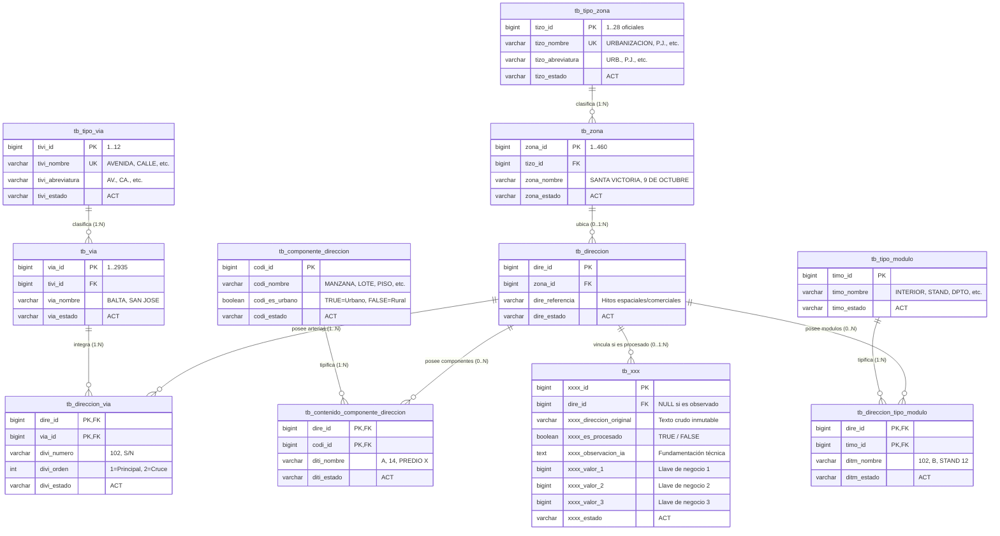

# ETL_DIRECCIONES - Sistema ETL de Normalización y Migración Catastral MPCH (Versión 2.0)

Arquitectura y motor en Python para la extracción, enriquecimiento semántico con **IA local (Ollama)** y persistencia relacional en **Tercera Forma Normal (3NF)** de direcciones para la **Municipalidad Provincial de Chiclayo (MPCH)** en PostgreSQL.

---

## 🌟 Novedades de la Versión 2.0

1. **Nomenclatura Institucional Global:**
   - Estandarización de tablas con prefijo `tb_` y atributos con prefijos nemotécnicos de 4 caracteres (`tivi_`, `via_`, `tizo_`, `zona_`, `dire_`, `divi_`, `codi_`, `diti_`, `timo_`, `ditm_`, `xxxx_`).
   - Estado de vigencia `varchar(3) DEFAULT 'ACT'` en todas las entidades.
2. **Modelo Relacional 3NF Desacoplado:**
   - La tabla de negocio emisora (`tb_xxx`) preserva la cadena intacta (`xxxx_direccion_original`) y vincula `dire_id` hacia `tb_direccion` **únicamente si el registro fue validado** (`xxxx_es_procesado = TRUE`).
   - Si el registro es observado o inconsistente, `dire_id` permanece en `NULL` y el dictamen técnico se fundamenta en `xxxx_observacion_ia`.
3. **Soporte de Multi-Vías (Esquinas e Intersecciones):**
   - Vía intermedia `tb_direccion_via` que modela direcciones en esquina (ej. *San José 102 con Luis Gonzales 801*) con orden de prevalencia (`divi_orden: 1, 2`) y número municipal por arteria.
4. **Componentes Catastrales Urbanos y Rurales:**
   - Catálogo `tb_componente_direccion` y tabla de contenidos `tb_contenido_componente_direccion` para registrar `MANZANA`, `LOTE`, `SUBLOTE`, `PISO`, `PREDIO`, `VALLE`, `SECTOR`, `UNIDAD CATASTRAL` y coordenadas geográficas.
5. **Módulos y Dependencias Inmobiliarias:**
   - Catálogo `tb_tipo_modulo` y tabla de contenidos `tb_direccion_tipo_modulo` para `INTERIOR`, `DEPARTAMENTO`, `PUERTA`, `STAND`, `TIENDA`, `OFICINA`, `BLOCK`, `PUESTO`, `LOCAL`, `COCHERA`.
6. **Confinamiento Estricto de Referencias:**
   - El campo `dire_referencia` en `tb_direccion` queda **estrictamente confinado a hitos espaciales y comerciales** (ej. *Mall Aventura*, *Real Plaza*, *Frente al Parque Principal*).
   - Ningún módulo ni componente catastral se desvía a referencia.
7. **Homologación de Catálogos Oficiales:**
   - **Estrictamente 28 tipos de zonas oficiales**: No existe el tipo 29. Toda `H.U.` o `HABILITACIÓN URBANA` se homologa automáticamente hacia `URBANIZACIÓN` (`tizo_id = 6`).
   - **Máxima coherencia semántica en zonas**: Si una dirección cita un tipo alternativo para una zona existente (ej. *Urb. 9 de Octubre*), el sistema lo vincula a la zona oficial `9 DE OCTUBRE` (`UPIS`, ID 60) sin rechazar el registro, documentando la homologación en la auditoría.
8. **Exportación Multipropósito (JSON, Excel, CSV):**
   - Descarga de reportes estructurados en formato **JSON jerárquico V2**, **Excel XLSX** y **CSV** tanto desde memoria en tiempo real como directamente desde la base de datos para los tres universos de registros: Procesados, Observados y Validados en Catastro.
9. **Asistente Web Interactivo en 5 Pasos:**
   - Interfaz gráfica web moderna (`http://localhost:8000`) para seleccionar motor de IA, esquema, tabla de origen, columnas dinámicas y visualización en tiempo real.

---

## 📐 Diagrama de Arquitectura Relacional V2



---

## 📁 Estructura del Repositorio

```text
ETL_MIGRACION_MPCH/
├── src/                                  # Código fuente Python V2
│   ├── config/                           # Configuración y variables de entorno
│   │   ├── settings.py                   # Pydantic BaseSettings (.env dinámico)
│   │   └── logging_config.py             # Setup de logs estructurados
│   ├── models/                           # Entidades y esquemas Pydantic V2
│   │   ├── catalogos.py                  # Modelos tb_tipo_via, tb_via, tb_tipo_zona, tb_zona, tb_componente_direccion, tb_tipo_modulo
│   │   ├── direccion_origen.py           # Entidad origen tb_xxx (xxxx_id, xxxx_direccion_original, dire_id)
│   │   ├── direccion_destino.py          # Entidad normalizada V2 (vias, componentes, modulos, dire_referencia)
│   │   └── llm_schemas.py                # Schema JSON V2 de inferencia estructurada para Ollama
│   ├── catalogs/                         # Capa desacoplada de catálogos maestros
│   │   ├── tipos_via.json                # 12 Tipos de vía oficiales
│   │   ├── tipos_zona.json               # 28 Tipos de zona oficiales
│   │   ├── vias_chiclayo.json            # 2,935 Vías físicas oficiales de Chiclayo
│   │   ├── zonas_chiclayo.json           # 460 Habilitaciones urbanas oficiales de Chiclayo
│   │   └── catalog_manager.py            # Gestor dinámico y sincronizador de catálogos
│   ├── services/                         # Conectores y servicios de infraestructura
│   │   ├── db_service.py                 # PostgreSQL: DDL automático V2, esquemas, catálogos
│   │   └── ollama_service.py             # Ollama: Healthcheck, modelos e inferencia estructurada
│   ├── extractors/                       # Extracción selectiva de datos (E)
│   │   ├── base_extractor.py             # Interfaz abstracta
│   │   └── db_extractor.py               # Extracción por lotes
│   ├── transformers/                     # Transformación, IA y homologación (T)
│   │   ├── base_transformer.py           # Interfaz abstracta
│   │   ├── text_cleaner.py               # Limpieza léxica y estandarización
│   │   ├── catalog_matcher.py            # Homologación con catálogos oficiales V2 (vías, módulos, componentes)
│   │   ├── ai_parser.py                  # Extracción semántica con IA y respaldo heurístico
│   │   └── pipeline_transformer.py       # Orquestador del flujo de transformación
│   ├── loaders/                          # Carga y Persistencia relacional (L)
│   │   ├── base_loader.py                # Interfaz abstracta
│   │   └── db_loader.py                  # Persistencia atómica en tb_direccion, tb_direccion_via, modulos, componentes
│   ├── pipelines/                        # Orquestación del Pipeline
│   │   └── etl_pipeline.py               # Pipeline integral V2 con notificaciones WebSocket en vivo
│   ├── ui/                               # Interfaz Web moderna (FastAPI + WebSocket + Vanilla JS)
│   │   ├── server.py                     # API REST, endpoints de exportación JSON/Excel/CSV y WebSockets
│   │   └── static/
│   │       ├── index.html                # Wizard en 5 pasos, métricas y cards de exportación
│   │       ├── styles.css                # Diseño visual responsive y temas
│   │       └── app.js                    # Lógica del cliente, gráficos en tiempo real y descargas
│   ├── utils/
│   │   └── prompts.py                    # Prompt de sistema V2 (reglas H.U., esquinas, módulos y referencias)
│   └── cli.py                            # Menú interactivo de consola (Rich)
├── scripts_data_base/                    # Scripts DDL para PostgreSQL
│   ├── 06_crear_estructura_v2_normalizada.sql # DDL V2 completo: 11 tablas, seeds y vista v_direcciones_v2
│   ├── 01_crear_catalogos_vias_y_zonas.sql
│   ├── 04_crear_schemas_de_prueba.sql
│   └── 05_crear_tablas_maestras_vias_y_zonas.sql
├── tests/                                # Suite de 135+ pruebas unitarias automatizadas
│   ├── test_v2_normalization_structure.py # Pruebas exclusivas de la arquitectura V2
│   ├── test_address_parsing_heuristics.py
│   ├── test_ai_address_observations.py
│   ├── test_normalization_quality_guarantees.py
│   ├── test_pipeline_structure.py
│   └── test_ui_server.py
├── docs/                                 # Documentación técnica
│   └── DIAGRAMA_BASE_DE_DATOS.md         # Modelo ER 3NF, diccionario de datos y consultas de auditoría
├── main.py                               # Punto de entrada principal (CLI / UI / Run)
└── docker-compose.yml                    # Stack Docker (PostgreSQL 16, pgAdmin 4)
```

---

## 🚀 Despliegue Rápido y Uso

### 1. Iniciar Base de Datos y pgAdmin con Docker:
```bash
docker compose up -d
```

### 2. Inicializar la Estructura V2 Normalizada:
```bash
docker exec -i mpch_postgres psql -U postgres -d bd_mpch < scripts_data_base/06_crear_estructura_v2_normalizada.sql
```

### 3. Iniciar el Asistente Web Interactivo:
```bash
./venv/bin/python main.py ui
```
Accede desde tu navegador a: **`http://localhost:8000`**

### Wizard de 5 Pasos en la Web:
1. **Paso 1 (Conexión):** Diagnóstico automático de PostgreSQL y Ollama.
2. **Paso 2 (Modelo IA):** Selección interactiva del modelo de lenguaje disponible.
3. **Paso 3 (Esquema & Tabla):** Selección del esquema (`public`, etc.) y de la tabla que contiene las direcciones crudas (`tb_xxx`, `direcciones_actual`).
4. **Paso 4 (Mapeo de Columnas):** Vinculación de la columna de ID, dirección cruda y llaves de negocio.
5. **Paso 5 (Ejecución & Exportación):** Procesamiento en vivo con métricas por segundo, consola de eventos WebSocket y botones para exportar en **JSON**, **Excel** y **CSV**.

---

## 📥 Exportación Estructurada (JSON, Excel, CSV)

El sistema provee endpoints dedicados para generar reportes en tres formatos:
- **`POST /api/export-json`**: Exporta las direcciones en formato JSON estructurado V2 con metadata, vías de intersección, módulos interiores y componentes catastrales.
- **`POST /api/export`**: Exporta en formato Excel `.xlsx` o CSV.
- **`POST /api/export-db`**: Permite la descarga directa consultando la base de datos física para cualquiera de los tres universos:
  - `status=procesados`: Direcciones que fueron normalizadas con éxito.
  - `status=observados`: Direcciones que no pudieron vincularse al catastro, con diagnóstico de IA.
  - `status=validos`: Registros con coherencia total.

---

## 🧪 Ejecución de Pruebas Automatizadas

El proyecto cuenta con **135+ pruebas unitarias automatizadas** que validan exhaustivamente:
- Detección y normalización de esquinas y multi-vías.
- Mapeo canónico de H.U. hacia Urbanización (respetando los 28 tipos).
- Máxima coherencia de zonas desalineadas (P.J./Urb. 9 de Octubre -> UPIS).
- Desacoplamiento de módulos inmobiliarios fuera de la referencia.
- Exportación estructurada JSON V2.
- Persistencia atómica relacional en PostgreSQL.

Para correr la suite de pruebas:
```bash
./venv/bin/pytest tests/ -k "not ollama"
```

---

## 🏛️ Municipalidad Provincial de Chiclayo
*Gerencia de Tecnología de la Información y Estadística — Subgerencia de Catastro y Tránsito.*
