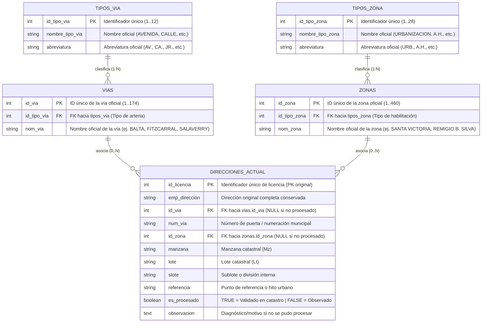
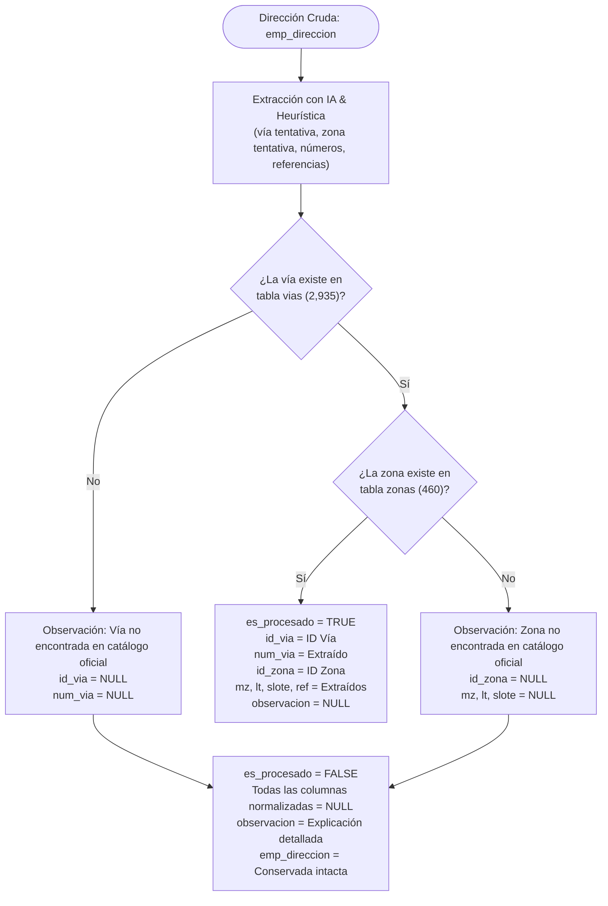

# Diagrama de Arquitectura y Modelo Relacional de Base de Datos

## 🏛️ Modelo Relacional Consolidado (Tercera Forma Normal - 3NF)

El siguiente diagrama entidad-relación (ER) describe la estructura consolidada oficial de la base de datos para la **Municipalidad Provincial de Chiclayo (MPCH)**.

En este modelo, la tabla `direcciones_actual` elimina la duplicidad y redundancia de almacenar cadenas de texto (`nom_via`, `nom_zona`, `tipo_via`, `tipo_zona`), enlazando directamente mediante claves foráneas (`id_via`, `id_zona`) hacia los catálogos maestros físicos oficiales de Chiclayo.



---

## 📋 Diccionario de Datos de la Tabla Consolidada: `direcciones_actual`

| Columna | Tipo de Dato | Nulable | Restricción / FK | Descripción |
| :--- | :--- | :---: | :--- | :--- |
| **`id_licencia`** | `INTEGER` | **NO** | `PRIMARY KEY` | Llave primaria original inmutable del registro. |
| **`emp_direccion`** | `VARCHAR(255)` / `TEXT`| **NO** | Ninguna | Cadena original intacta de la dirección para auditoría histórica. |
| **`id_via`** | `INTEGER` | SÍ | `FK -> vias(id_via)` | Vía física oficial de Chiclayo vinculada. `NULL` si no existe o fue observada. |
| **`num_via`** | `VARCHAR(50)` | SÍ | Ninguna | Numeración de la vía (ej. `129`, `450`, `S/N`). `NULL` si fue observada. |
| **`id_zona`** | `INTEGER` | SÍ | `FK -> zonas(id_zona)` | Habilitación urbana oficial vinculada. `NULL` si no existe o fue observada. |
| **`manzana`** | `VARCHAR(20)` | SÍ | Ninguna | Manzana del predio. `NULL` si fue observada. |
| **`lote`** | `VARCHAR(20)` | SÍ | Ninguna | Lote del predio. `NULL` si fue observada. |
| **`slote`** | `VARCHAR(20)` | SÍ | Ninguna | Sublote o departamento interno. `NULL` si fue observada. |
| **`referencia`** | `VARCHAR(255)` | SÍ | Ninguna | Hito urbano de guía (ej. `CERCA AL SENATI`). `NULL` si fue observada. |
| **`es_procesado`** | `BOOLEAN` | **NO** | `DEFAULT FALSE` | Indicador de control: `TRUE` (Éxito oficial), `FALSE` (Observado/No procesado). |
| **`observacion`** | `TEXT` | SÍ | Ninguna | Detalle explicativo de la inconsistencia o motivo de rechazo. |

---

## ⚙️ Reglas de Negocio y Estados de Procesamiento



### 1. Caso `es_procesado = TRUE` (Normalización Exitosa)
- Todas las entidades identificadas en la dirección coincidieron con las tablas oficiales `vias` y/o `zonas`.
- `id_via` y/o `id_zona` quedan debidamente poblados con sus claves foráneas.
- Las columnas de desglose municipal (`num_via`, `manzana`, `lote`, `slote`, `referencia`) se conservan con su valor correspondiente.
- `observacion` queda en `NULL`.

### 2. Caso `es_procesado = FALSE` (Registro Observado)
- Si una vía o zona mencionada en la dirección **no se encuentra en las tablas maestras oficiales**, o el registro es ambiguo:
- `id_via = NULL`
- `num_via = NULL`
- `id_zona = NULL`
- `manzana = NULL`
- `lote = NULL`
- `slote = NULL`
- `referencia = NULL`
- **`emp_direccion` permanece intacta** con el texto completo original para permitir la subsanación.
- **`observacion` registra el motivo exacto:**
  - *Ejemplo:* `"Vía 'TRINDIAD' no existe en el catálogo maestro de vías de Chiclayo."`
  - *Ejemplo:* `"Zona/Habilitación 'URB. DESCONOCIDA' no existe en el catálogo de zonas oficiales de Chiclayo."`
  - *Ejemplo:* `"DIRECCIÓN NO RECONOCIDA: No se identificó ninguna vía ni habilitación urbana válida en el texto."`

---

## 🔍 Consultas SQL de Explotación y Reportes

### 1. Reconstruir la dirección normalizada completa con nombres oficiales:
```sql
SELECT 
    d.id_licencia,
    d.emp_direccion AS direccion_original,
    tv.nombre_tipo_via,
    v.nom_via AS via_oficial,
    d.num_via,
    tz.nombre_tipo_zona,
    z.nom_zona AS zona_oficial,
    d.manzana,
    d.lote,
    d.referencia,
    d.es_procesado
FROM direcciones_actual d
LEFT JOIN vias v ON d.id_via = v.id_via
LEFT JOIN tipos_via tv ON v.id_tipo_via = tv.id_tipo_via
LEFT JOIN zonas z ON d.id_zona = z.id_zona
LEFT JOIN tipos_zona tz ON z.id_tipo_zona = tz.id_tipo_zona
WHERE d.es_procesado = TRUE;
```

### 2. Consultar direcciones observadas para regularización catastral:
```sql
SELECT 
    id_licencia,
    emp_direccion,
    observacion
FROM direcciones_actual
WHERE es_procesado = FALSE;
```

### 3. Métricas de efectividad de normalización:
```sql
SELECT 
    COUNT(*) AS total_direcciones,
    COUNT(*) FILTER (WHERE es_procesado = TRUE) AS normalizadas_exitosas,
    COUNT(*) FILTER (WHERE es_procesado = FALSE) AS observadas_pendientes,
    ROUND(COUNT(*) FILTER (WHERE es_procesado = TRUE) * 100.0 / COUNT(*), 2) AS porcentaje_efectividad
FROM direcciones_actual;
```
