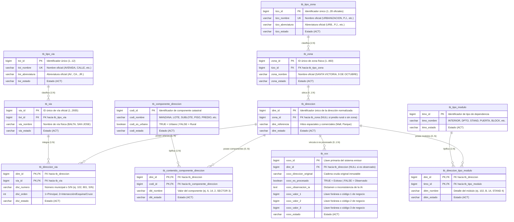

# Diagrama de Arquitectura y Modelo Relacional de Base de Datos (Versión 2.0)

## 🏛️ Modelo Relacional Normalizado (Tercera Forma Normal - 3NF)

La **Versión 2.0** del sistema de normalización de la **Municipalidad Provincial de Chiclayo (MPCH)** implementa una arquitectura relacional en **Tercera Forma Normal (3NF)** con **nomenclatura institucional estandarizada**. 

### 📐 Principios de Nomenclatura Global:
1. **Prefijo Institucional de Tablas:** Todas las tablas de normalización llevan el prefijo `tb_`.
2. **Prefijo de Atributos de 4 Caracteres:** Cada columna posee un prefijo de 4 letras único que identifica a su entidad:
   - `tb_tipo_via` $\rightarrow$ `tivi_`
   - `tb_via` $\rightarrow$ `via_`
   - `tb_tipo_zona` $\rightarrow$ `tizo_`
   - `tb_zona` $\rightarrow$ `zona_`
   - `tb_direccion` $\rightarrow$ `dire_`
   - `tb_direccion_via` $\rightarrow$ `divi_`
   - `tb_componente_direccion` $\rightarrow$ `codi_`
   - `tb_contenido_componente_direccion` $\rightarrow$ `diti_`
   - `tb_tipo_modulo` $\rightarrow$ `timo_`
   - `tb_direccion_tipo_modulo` $\rightarrow$ `ditm_`
   - Tabla fuente/negocio (`tb_xxx`) $\rightarrow$ `xxxx_`
3. **Indicador de Estado:** Todos los catálogos y relaciones contienen un campo de estado `varchar(3) DEFAULT 'ACT'`.
4. **Desacoplamiento Total de la Fuente:** La tabla de negocio (`tb_xxx`) preserva la cadena original intacta (`xxxx_direccion_original`) y solo almacena la clave foránea `dire_id` hacia `tb_direccion` cuando el registro ha sido normalizado exitosamente (`xxxx_es_procesado = TRUE`). En caso de observación o rechazo, `dire_id` permanece en `NULL` y se describe el dictamen técnico en `xxxx_observacion_ia`.

---

## 📊 Diagrama Entidad-Relación (Mermaid ERD)



---

## 🗄️ Diccionario de Datos de la Estructura V2

### 1. `tb_tipo_via`
Catálogo institucional que categoriza las arterias viales urbanas y periurbanas de Chiclayo.
- **`tivi_id`** (`BIGSERIAL`, PK): Identificador único (1..12).
- **`tivi_nombre`** (`VARCHAR(50)`, UNIQUE, NOT NULL): Nombre del tipo de arteria (`AVENIDA`, `CALLE`, `JIRON`, `PASAJE`, `PROLONGACION`, `CARRETERA`, `MALECON`, `ALAMEDA`, etc.).
- **`tivi_abreviatura`** (`VARCHAR(10)`, NOT NULL): Abreviatura oficial (`AV.`, `CA.`, `JR.`, `PJ.`, `PR.`, `CT.`, etc.).
- **`tivi_estado`** (`VARCHAR(3)`, NOT NULL, DEFAULT `'ACT'`): Estado del registro.

### 2. `tb_via`
Catálogo maestro de vías públicas físicas codificadas de Chiclayo (2,935 vías).
- **`via_id`** (`BIGSERIAL`, PK): Identificador de la vía física oficial.
- **`tivi_id`** (`BIGINT`, FK, NOT NULL): Referencia a `tb_tipo_via.tivi_id`.
- **`via_nombre`** (`VARCHAR(255)`, NOT NULL): Denominación oficial de la vía (ej. `JOSE BALTA`, `LUIS GONZALES`, `PEDRO RUIZ GALLO`).
- **`via_estado`** (`VARCHAR(3)`, NOT NULL, DEFAULT `'ACT'`): Estado del registro.

### 3. `tb_tipo_zona`
Catálogo institucional cerrado de habilitaciones urbanas de Chiclayo (**estrictamente 28 tipos oficiales**).
- **`tizo_id`** (`BIGSERIAL`, PK): Identificador único (1..28).
- **`tizo_nombre`** (`VARCHAR(100)`, UNIQUE, NOT NULL): Denominación (`URBANIZACION`, `PUEBLO JOVEN`, `ASENTAMIENTO HUMANO`, `UNIDAD VECINAL`, `CONJ. HABITACIONAL`, `UPIS`, etc.).
- **`tizo_abreviatura`** (`VARCHAR(10)`, NOT NULL): Abreviatura (`URB.`, `P.J.`, `A.H.`, `U.V.`, `C.H.`, `UPIS`, etc.).
- **`tizo_estado`** (`VARCHAR(3)`, NOT NULL, DEFAULT `'ACT'`): Estado del registro.

### 4. `tb_zona`
Catálogo maestro de habilitaciones urbanas, pueblos jóvenes y sectores físicos de Chiclayo (460 zonas).
- **`zona_id`** (`BIGSERIAL`, PK): Identificador de la zona oficial.
- **`tizo_id`** (`BIGINT`, FK, NOT NULL): Referencia a `tb_tipo_zona.tizo_id`.
- **`zona_nombre`** (`VARCHAR(255)`, NOT NULL): Nombre oficial de la habilitación (ej. `SANTA VICTORIA`, `9 DE OCTUBRE`, `DIEGO FERRE`).
- **`zona_estado`** (`VARCHAR(3)`, NOT NULL, DEFAULT `'ACT'`): Estado del registro.

### 5. `tb_direccion`
Entidad central que consolida cada dirección normalizada y validada.
- **`dire_id`** (`BIGSERIAL`, PK): Identificador único de la dirección física normalizada.
- **`zona_id`** (`BIGINT`, FK, NULLABLE): Clave foránea a `tb_zona.zona_id`. Nulo si no posee zona o es rural.
- **`dire_referencia`** (`VARCHAR(500)`, NULLABLE): Hitos espaciales y comerciales exclusivos de orientación (ej. `FRENTE A REAL PLAZA`, `A ESPALDAS DEL PARQUE PRINCIPAL`).
- **`dire_estado`** (`VARCHAR(3)`, NOT NULL, DEFAULT `'ACT'`): Estado del registro.

### 6. `tb_direccion_via`
Tabla intermedia muchos a muchos que modela arterias viales, esquinas e intersecciones.
- **`dire_id`** (`BIGINT`, PK, FK): Referencia a `tb_direccion.dire_id`.
- **`via_id`** (`BIGINT`, PK, FK): Referencia a `tb_via.via_id`.
- **`divi_numero`** (`VARCHAR(20)`, NULLABLE): Numeración municipal o `S/N` (ej. `102`, `801`, `S/N`).
- **`divi_orden`** (`INT`, DEFAULT `1`): Orden de la arteria (`1` = Vía principal, `2` = Vía de intersección/esquina transversal).
- **`divi_estado`** (`VARCHAR(3)`, NOT NULL, DEFAULT `'ACT'`): Estado del registro.

### 7. `tb_componente_direccion`
Catálogo de componentes catastrales urbanos y rurales.
- **`codi_id`** (`BIGSERIAL`, PK): Identificador del componente.
- **`codi_nombre`** (`VARCHAR(100)`, NOT NULL): Denominación (`MANZANA`, `LOTE`, `SUBLOTE`, `PISO`, `PREDIO`, `VALLE`, `SECTOR`, `UNIDAD CATASTRAL`, `COORDENADA NORTE`, `COORDENADA ESTE`).
- **`codi_es_urbano`** (`BOOLEAN`, DEFAULT `TRUE`): Indicador de ámbito (`TRUE` para urbano, `FALSE` para rural/catastral extenso).
- **`codi_estado`** (`VARCHAR(3)`, NOT NULL, DEFAULT `'ACT'`): Estado del registro.

### 8. `tb_contenido_componente_direccion`
Detalle de componentes catastrales asignados a cada dirección.
- **`dire_id`** (`BIGINT`, PK, FK): Referencia a `tb_direccion.dire_id`.
- **`codi_id`** (`BIGINT`, PK, FK): Referencia a `tb_componente_direccion.codi_id`.
- **`diti_nombre`** (`VARCHAR(100)`, NULLABLE): Valor asignado (ej. `A`, `14`, `3`, `VALLE REQUE`).
- **`diti_estado`** (`VARCHAR(3)`, NOT NULL, DEFAULT `'ACT'`): Estado del registro.

### 9. `tb_tipo_modulo`
Catálogo de dependencias habitacionales, comerciales e interiores.
- **`timo_id`** (`BIGSERIAL`, PK): Identificador de módulo.
- **`timo_nombre`** (`VARCHAR(100)`, NOT NULL): Denominación (`INTERIOR`, `DEPARTAMENTO`, `PUERTA`, `STAND`, `TIENDA`, `OFICINA`, `BLOCK`, `PUESTO`, `LOCAL`, `COCHERA`).
- **`timo_estado`** (`VARCHAR(3)`, NOT NULL, DEFAULT `'ACT'`): Estado del registro.

### 10. `tb_direccion_tipo_modulo`
Detalle de dependencias y módulos interiores asignados a cada dirección.
- **`dire_id`** (`BIGINT`, PK, FK): Referencia a `tb_direccion.dire_id`.
- **`timo_id`** (`BIGINT`, PK, FK): Referencia a `tb_tipo_modulo.timo_id`.
- **`ditm_nombre`** (`VARCHAR(100)`, NULLABLE): Valor o código interior (ej. `102`, `B`, `STAND 4`, `OF 201`).
- **`ditm_estado`** (`VARCHAR(3)`, NOT NULL, DEFAULT `'ACT'`): Estado del registro.

### 11. `tb_xxx` (Arquetipo de Referencia / Tabla de Negocio Emisora)
Representa cualquier tabla origen existente en los sistemas emisores de la MPCH (ej. `direcciones_actual`, `licencias_funcionamiento`, `catastro_predial`) que almacena la dirección original y recibe las columnas de vinculación normalizada (`dire_id`, `es_procesado`, `observacion_ia`).

> [!NOTE]
> **`tb_xxx` es un esquema arquetípico de referencia**, no una tabla física creada por el DDL (`06_crear_estructura_v2_normalizada.sql`). En producción o pruebas, el ETL opera dinámicamente sobre la tabla real que el usuario elija en el Paso 2 del asistente web o configure en el pipeline, asegurando que las columnas `dire_id`, `es_procesado` y `observacion_ia` se incorporen en sitio sin alterar las columnas ni los IDs originales del negocio.

- **`xxxx_id`** (`BIGSERIAL` o PK existente): Identificador único del registro emisor (inmutable).
- **`dire_id`** (`BIGINT`, FK, NULLABLE): Referencia foránea a `tb_direccion.dire_id`. **Solo se puebla si la normalización es exitosa (`es_procesado = TRUE`)**.
- **`xxxx_direccion_original`** (`VARCHAR(500)`, NOT NULL): Texto crudo original inmutable tal como ingresó en el sistema origen.
- **`xxxx_es_procesado`** (`BOOLEAN`, NOT NULL, DEFAULT `FALSE`): Indicador de normalización (`TRUE` = Validado, `FALSE` = Observado).
- **`xxxx_observacion_ia`** (`TEXT`, NULLABLE): Diagnóstico y fundamentación técnica emitida por el modelo LLM o motor heurístico.
- **`xxxx_valor_1`**, **`xxxx_valor_2`**, **`xxxx_valor_3`** (`BIGINT`, NULLABLE): Atributos y llaves de negocio propios del sistema emisor (preservados intactos).
- **`xxxx_estado`** (`VARCHAR(3)`, NOT NULL, DEFAULT `'ACT'`): Estado del registro.

---

## ⚖️ Reglas de Negocio V2.0

### 1. Tratamiento Estricto de H.U. (Habilitación Urbana)
- En el glosario institucional existen **exactamente 28 tipos de zonas oficiales**. No se crea ningún tipo número 29.
- Cualquier mención de `H.U.` o `HABILITACIÓN URBANA` en las direcciones de origen se homologa canónicamente hacia `URBANIZACIÓN` (`tizo_id = 6`, `tizo_abreviatura = 'URB.'`).

### 2. Resolución de Incongruencias de Zona (ej. 9 de Octubre)
- Si una dirección cita un tipo no coincidente pero el nombre de zona concuerda inequívocamente con el catálogo oficial (ej. `URB. 9 DE OCTUBRE`), el sistema aplica **criterio de máxima coherencia semántica**: asocia el registro a la zona física oficial `9 DE OCTUBRE` (`zona_id = 60`, tipo oficial `UPIS`). El registro se normaliza con éxito y se registra en `xxxx_observacion_ia` una nota informativa de homologación.

### 3. Direcciones en Esquina e Intersección Vial (Multi-Vía)
- Cuando una dirección hace referencia a dos arterias viales cruzadas (ej. `SAN JOSE 102 CON LUIS GONZALES 801`), ambas vías se validan contra `tb_via`.
- Si ambas existen, se insertan dos filas en `tb_direccion_via` vinculadas al mismo `dire_id`:
  - `via_id` 1: Vía principal (`divi_orden = 1`, `divi_numero = '102'`).
  - `via_id` 2: Vía de cruce (`divi_orden = 2`, `divi_numero = '801'`).

### 4. Confinamiento de Referencias (`dire_referencia`)
- El campo `dire_referencia` queda **estrictamente confinado a hitos espaciales y comerciales** (ej. `MALL AVENTURA`, `REAL PLAZA`, `FRENTE AL PARQUE PRINCIPAL`).
- Ningún módulo (`STAND`, `INTERIOR`, `DPTO`, `PUERTA`, `OFICINA`, `BLOCK`) ni componente (`MANZANA`, `LOTE`, `PISO`) puede almacenarse en `dire_referencia`; cada uno se distribuye atómicamente a sus tablas hijas correspondientes (`tb_direccion_tipo_modulo` y `tb_contenido_componente_direccion`).

---

## 🔎 Vista SQL Desnormalizada: `v_direcciones_v2`

Para facilitar la consulta, reportería y exportación sin requerir joins manuales complejos, el DDL incluye la vista oficial `v_direcciones_v2`:

```sql
CREATE OR REPLACE VIEW public.v_direcciones_v2 AS
SELECT 
    d.dire_id,
    d.dire_referencia,
    d.dire_estado,
    z.zona_id,
    z.zona_nombre,
    tz.tizo_id,
    tz.tizo_nombre,
    tz.tizo_abreviatura,
    COALESCE(
        json_agg(
            DISTINCT jsonb_build_object(
                'via_id', v.via_id,
                'via_nombre', v.via_nombre,
                'tipo_via', tv.tivi_nombre,
                'numero', dv.divi_numero,
                'orden', dv.divi_orden
            )
        ) FILTER (WHERE v.via_id IS NOT NULL), '[]'::json
    ) AS vias,
    COALESCE(
        json_agg(
            DISTINCT jsonb_build_object(
                'codi_id', cd.codi_id,
                'componente', cd.codi_nombre,
                'valor', ccd.diti_nombre,
                'es_urbano', cd.codi_es_urbano
            )
        ) FILTER (WHERE cd.codi_id IS NOT NULL), '[]'::json
    ) AS componentes,
    COALESCE(
        json_agg(
            DISTINCT jsonb_build_object(
                'timo_id', tm.timo_id,
                'tipo_modulo', tm.timo_nombre,
                'valor', dtm.ditm_nombre
            )
        ) FILTER (WHERE tm.timo_id IS NOT NULL), '[]'::json
    ) AS modulos
FROM public.tb_direccion d
LEFT JOIN public.tb_zona z ON d.zona_id = z.zona_id
LEFT JOIN public.tb_tipo_zona tz ON z.tizo_id = tz.tizo_id
LEFT JOIN public.tb_direccion_via dv ON d.dire_id = dv.dire_id AND dv.divi_estado = 'ACT'
LEFT JOIN public.tb_via v ON dv.via_id = v.via_id
LEFT JOIN public.tb_tipo_via tv ON v.tivi_id = tv.tivi_id
LEFT JOIN public.tb_contenido_componente_direccion ccd ON d.dire_id = ccd.dire_id AND ccd.diti_estado = 'ACT'
LEFT JOIN public.tb_componente_direccion cd ON ccd.codi_id = cd.codi_id
LEFT JOIN public.tb_direccion_tipo_modulo dtm ON d.dire_id = dtm.dire_id AND dtm.ditm_estado = 'ACT'
LEFT JOIN public.tb_tipo_modulo tm ON dtm.timo_id = tm.timo_id
GROUP BY d.dire_id, d.dire_referencia, d.dire_estado, z.zona_id, z.zona_nombre, tz.tizo_id, tz.tizo_nombre, tz.tizo_abreviatura;
```

---

## 📈 Consultas SQL de Auditoría y Control de Calidad

### 1. Reconstrucción completa de una dirección con sus esquinas y dependencias:
```sql
SELECT 
    x.xxxx_id,
    x.xxxx_direccion_original,
    x.xxxx_es_procesado,
    v.*
FROM public.tb_xxx x
LEFT JOIN public.v_direcciones_v2 v ON x.dire_id = v.dire_id
WHERE x.xxxx_es_procesado = TRUE;
```

### 2. Auditoría de registros observados con diagnóstico IA:
```sql
SELECT 
    xxxx_id,
    xxxx_direccion_original,
    xxxx_observacion_ia
FROM public.tb_xxx
WHERE xxxx_es_procesado = FALSE;
```

### 3. Métricas de efectividad de normalización V2:
```sql
SELECT 
    COUNT(*) AS total_registros,
    COUNT(*) FILTER (WHERE xxxx_es_procesado = TRUE) AS normalizados_exitosos,
    COUNT(*) FILTER (WHERE xxxx_es_procesado = FALSE) AS observados_pendientes,
    ROUND(COUNT(*) FILTER (WHERE xxxx_es_procesado = TRUE) * 100.0 / COUNT(*), 2) AS efectividad_porcentaje
FROM public.tb_xxx;
```
