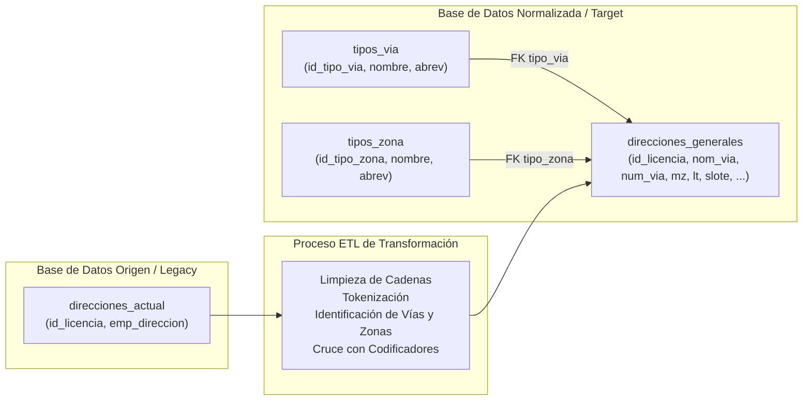
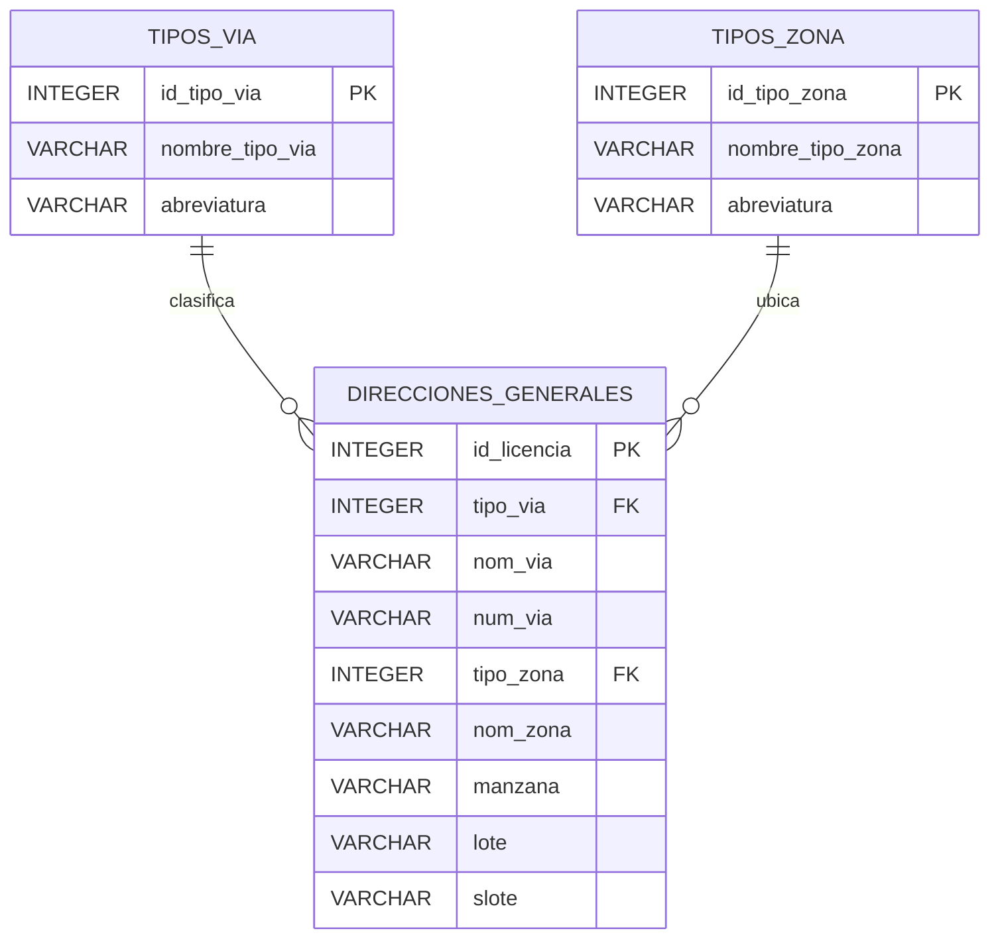

# Guía de Arquitectura y Migración ETL de Direcciones - MPCH

> **Proyecto:** ETL Migración de Direcciones de Licencias Comerciales  
> **Entidad:** Municipalidad Provincial de Chiclayo (MPCH)  
> **Motor de Base de Datos:** PostgreSQL  
> **Directorio de Scripts:** `scripts_data_base/`  

---

## 1. Visión General del Proceso ETL

El objetivo central de este proyecto es transformar los registros históricos de direcciones de licencias de funcionamiento de la Municipalidad Provincial de Chiclayo (MPCH), pasando de un modelo monolítico no estructurado a un **modelo relacional normalizado** conforme a los estándares de catastro urbano nacional y municipal.



---

## 2. Comparativa de Modelos de Base de Datos

### 2.1. Modelo Origen (Actual / Legacy)
* **Archivo SQL:** [`scripts_data_actual.sql`](file:///home/victorchung/IdeaProjects/ETL_MIGRACION_MPCH/scripts_data_base/scripts_data_actual.sql)
* **Propósito:** Almacenar la réplica exacta de los datos actuales antes de cualquier transformación.
* **Problema que resuelve:** Permite disponer de una zona de staging donde se cargan los más de 42,000 registros provenientes de los sistemas legados sin riesgo de pérdidas.

#### Estructura de la Tabla `direcciones_actual`:
| Columna | Tipo | Nulable | PK/FK | Descripción |
| :--- | :--- | :---: | :---: | :--- |
| `id_licencia` | `INTEGER` | NO | **PK** | Identificador único de la licencia municipal / empresa. |
| `emp_direccion` | `VARCHAR(255)` | SÍ | - | Cadena de texto libre con la dirección completa sin estructurar. |

---

### 2.2. Modelo Normalizado (Destino ETL)
* **Archivo SQL:** [`scripts_data_etl_new.sql`](file:///home/victorchung/IdeaProjects/ETL_MIGRACION_MPCH/scripts_data_base/scripts_data_etl_new.sql)
* **Propósito:** Descomponer atómicamente la dirección en componentes espaciales y catastrales estandarizados.
* **Beneficios:**
  - Facilita la georreferenciación y cruce con el Catastro Urbano.
  - Elimina redundancias e inconsistencias tipográficas.
  - Permite búsquedas precisas por vía, número, zona, manzana y lote.



---

## 3. Especificación Detallada de Tablas Normalizadas

### 3.1. Tabla Maestra: `tipos_via`
Almacena los tipos de vía urbana homologados según el Codificador de Vías de Chiclayo.

| Campo | Tipo | Restricción | Descripción |
| :--- | :--- | :--- | :--- |
| `id_tipo_via` | `INTEGER` | `PRIMARY KEY` | Código identificador del tipo de vía. |
| `nombre_tipo_via` | `VARCHAR(50)` | `NOT NULL` | Denominación completa (CALLE, AVENIDA, JIRÓN, etc.). |
| `abreviatura` | `VARCHAR(15)` | `NULL` | Abreviatura catastral estándar (CA., AV., JR., etc.). |

#### Catálogo Semilla de Vías:
| ID | Nombre | Abreviatura |
| :-: | :--- | :--- |
| **1** | CALLE | CA. |
| **2** | AVENIDA | AV. |
| **3** | JIRÓN | JR. |
| **4** | PASAJE | PJE. |
| **5** | CARRETERA | CTRA. |
| **6** | PROLONGACIÓN | PRLG. |
| **7** | PROLONGACIÓN AVENIDA | PRLG.AV |
| **8** | ALAMEDA | AL. |
| **9** | PARQUE | PQ. |
| **10** | ÓVALO | OV. |
| **99** | OTRO / SIN TIPO | OTRO |

---

### 3.2. Tabla Maestra: `tipos_zona`
Almacena las clasificaciones de habilitación urbana y asentamientos del distrito de Chiclayo.

| Campo | Tipo | Restricción | Descripción |
| :--- | :--- | :--- | :--- |
| `id_tipo_zona` | `INTEGER` | `PRIMARY KEY` | Código identificador del tipo de zona. |
| `nombre_tipo_zona` | `VARCHAR(100)` | `NOT NULL` | Denominación (URBANIZACIÓN, PUEBLO JOVEN, etc.). |
| `abreviatura` | `VARCHAR(20)` | `NULL` | Abreviatura estándar (URB., P.J., CONJ.RES., etc.). |

#### Catálogo Semilla de Zonas:
| ID | Nombre | Abreviatura |
| :-: | :--- | :--- |
| **1** | URBANIZACIÓN | URB. |
| **2** | CONJUNTO RESIDENCIAL | CONJ.RES. |
| **3** | PUEBLO JOVEN | P.J. |
| **4** | ASENTAMIENTO HUMANO | A.H. |
| **5** | CERCADO DE CHICLAYO | CERCADO |
| **6** | HABILITACIÓN URBANA | H.U. |
| **7** | ASOCIACIÓN DE VIVIENDA | ASOC.VIV. |
| **8** | ASOCIACIÓN PRO-VIVIENDA | ASOC.PVIV. |
| **9** | COOPERATIVA DE VIVIENDA | COOP.VIV. |
| **10** | CONJUNTO HABITACIONAL | CONJ.HAB. |
| **11** | PROGRAMA MUNICIPAL / UPIS | UPIS |
| **12** | FUNDO / PREDIO | FDO. |
| **99** | OTRO / SECTOR GENERAL | OTRO |

---

### 3.3. Tabla Principal: `direcciones_generales`
Almacena cada dirección normalizada asociada a su respectiva licencia municipal.

| Columna | Tipo | Clave | Nullable | Descripción |
| :--- | :--- | :---: | :---: | :--- |
| `id_licencia` | `INTEGER` | **PK** | NO | Identificador único de la licencia comercial. |
| `tipo_via` | `INTEGER` | **FK** | SÍ | Referencia a `tipos_via.id_tipo_via`. |
| `nom_via` | `VARCHAR(150)` | - | SÍ | Nombre oficial de la vía (ej. MOISES R. VALIENTE). |
| `num_via` | `VARCHAR(50)` | - | SÍ | Numeración de la vía o indicación S/N / Dpto. |
| `tipo_zona` | `INTEGER` | **FK** | SÍ | Referencia a `tipos_zona.id_tipo_zona`. |
| `nom_zona` | `VARCHAR(150)` | - | SÍ | Nombre de la urbanización, sector o asentamiento. |
| `manzana` | `VARCHAR(20)` | - | SÍ | Letra o número de manzana (Mz). |
| `lote` | `VARCHAR(20)` | - | SÍ | Número de lote (Lt). |
| `slote` | `VARCHAR(20)` | - | SÍ | Sublote o división interna si existe. |

---

## 4. Ejemplos de Normalización (Casos Reales del Dataset)

A continuación se ilustra cómo se mapean las cadenas originales de `emp_direccion` hacia la tabla `direcciones_generales`:

| Cadena Original (`emp_direccion`) | `tipo_via` | `nom_via` | `num_via` | `tipo_zona` | `nom_zona` | `manzana` | `lote` |
| :--- | :-: | :--- | :--- | :-: | :--- | :-: | :-: |
| `URB. LOS PRECURSORES CA. MOISES R. VALIENTE N 349` | 1 *(CA.)* | MOISES R. VALIENTE | 349 | 1 *(URB.)* | LOS PRECURSORES | *null* | *null* |
| `LA ESTANCIA - I ETAPA MZ. D LOTE 43` | *null* | *null* | *null* | 6 *(H.U.)* | LA ESTANCIA - I ETAPA | D | 43 |
| `CA. FRANCISCO DE PAULA VIGIL S/N CONJ.RES. DIEGO FERRE MZ. 18 LT. 12` | 1 *(CA.)* | FRANCISCO DE PAULA VIGIL | S/N | 2 *(CONJ.RES.)* | DIEGO FERRE | 18 | 12 |
| `AV. SESQUICENTENARIO N 741 URB. SANTA VICTORIA II ETAPA LT. 25` | 2 *(AV.)* | SESQUICENTENARIO | 741 | 1 *(URB.)* | SANTA VICTORIA II ETAPA | *null* | 25 |
| `PREDIO CHACUPE SECTOR MZ. R LT. 8` | *null* | *null* | *null* | 12 *(FDO.)* | PREDIO CHACUPE SECTOR | R | 8 |
| `CA. VICENTE DE LA VEGA N 1673 - DPTO 2 MZ. 8 LT. 29 CONJ.RES. SUAZO` | 1 *(CA.)* | VICENTE DE LA VEGA | 1673 - DPTO 2 | 2 *(CONJ.RES.)* | SUAZO | 8 | 29 |
| `CA. CRISTOBAL COLON N 624 CERCADO DE CHICLAYO LT. 22` | 1 *(CA.)* | CRISTOBAL COLON | 624 | 5 *(CERCADO)* | CERCADO DE CHICLAYO | *null* | 22 |

---

## 5. Vista de Reconstrucción de Dirección

Para consultar las direcciones con sus nombres legibles sin tener que hacer JOINs manuales cada vez, el script `scripts_data_etl_new.sql` incluye la vista:

```sql
SELECT * FROM v_direcciones_completas;
```

Esta vista retorna las columnas originales desglosadas más la columna calculada `direccion_formateada`, la cual reconstruye la dirección formal:
> *Ejemplo:* `"CA. MOISES R. VALIENTE N° 349 URB. LOS PRECURSORES"`

---

## 6. Procedimiento de Ejecución en PostgreSQL

1. **Creación de la base de datos de origen:**
   ```bash
   psql -U postgres -d bd_mpch -f scripts_data_base/scripts_data_actual.sql
   ```
2. **Carga masiva de datos crudos (desde CSV exportado):**
   ```sql
   \copy direcciones_actual (id_licencia, emp_direccion) FROM 'docs/data/Direcciones_.csv' WITH (FORMAT csv, HEADER true, DELIMITER ',', ENCODING 'UTF8');
   ```
3. **Creación de la base de datos normalizada:**
   ```bash
   psql -U postgres -d bd_mpch -f scripts_data_base/scripts_data_etl_new.sql
   ```
4. **Validación:**
   ```sql
   SELECT COUNT(*) FROM tipos_via;
   SELECT COUNT(*) FROM tipos_zona;
   SELECT COUNT(*) FROM direcciones_generales;
   ```
