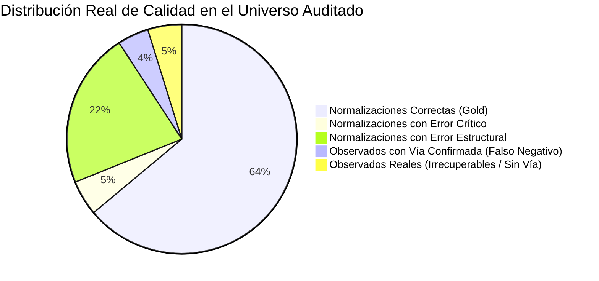

# INFORME TÉCNICO DE AUDITORÍA Y ANÁLISIS DE INCONGRUENCIAS EN LA NORMALIZACIÓN DE DIRECCIONES

**Lote Analizado:** `reporte_direcciones_licencias_processed_20260923_084237.json`  
**Ubicación:** `reporte_completo_data/`  
**Tamaño del Dataset:** 24.8 MB (41,462 registros)  
**Fecha de Auditoría:** 23 de Septiembre de 2026  
**Especialidad:** Auditoría de Calidad de Datos Geocatastrales y Entrenamiento de Modelos de Inteligencia Artificial  
**Estado de la Data:** Preservada 100% íntegra (auditoría en modo de solo lectura, sin alteración de datos)

---

## 1. Resumen Ejecutivo y Métricas Globales del Margen de Error

Se ha llevado a cabo una auditoría integral sobre el universo de **41,462 registros** resultantes del proceso de homologación de direcciones de licencias de funcionamiento de la Municipalidad Provincial de Chiclayo (MPCH). El cotejo se efectuó cruzando la información cruda (`Dirección Registrada`), las extracciones intermedias, las observaciones emitidas y los catálogos oficiales maestros (`vias_chiclayo.json` con 2,935 vías y `zonas_chiclayo.json` con 460 habilitaciones urbanas).

### Tablero de Control de la Auditoría

| Métrica Catastral / Calidad | Cantidad de Registros | % del Total (41,462) | % de su Categoría |
| :--- | :---: | :---: | :---: |
| **Universo Total Auditado** | **41,462** | **100.00%** | - |
| **Registros en Estado NORMALIZADO (Nominal)** | **37,658** | **90.83%** | 100.00% |
| **Registros en Estado OBSERVADO** | **3,804** | **9.17%** | 100.00% |
| 🔴 **Margen de Error Crítico en Normalizados** | **2,058** | **4.96%** | **5.46%** *(de Normalizados)* |
| 🟡 **Margen de Incongruencias Estructurales / Formato** | **9,104** | **21.96%** | **24.18%** *(de Normalizados)* |
| ⚠️ **Margen de Defectos Total en NORMALIZADOS** | **11,162** | **26.92%** | **29.64%** *(de Normalizados)* |
| 🟢 **Normalizaciones Limpias y Confiables (Gold Standard)** | **26,496** | **63.91%** | **70.36%** *(de Normalizados)* |
| 🔵 **Falsos Negativos Recuperables en OBSERVADOS** | **1,821** | **4.39%** | **47.87%** *(de Observados)* |
| 🏢 **Rechazo Erróneo por Centro Comercial / Mall** | **892** | **2.15%** | **23.45%** *(de Observados)* |



> [!CAUTION]
> **Conclusión Ejecutiva de Margen de Error:**
> 1. Aunque el proceso reporta formalmente una tasa de éxito nominal del **90.83%**, la tasa real de normalizaciones libres de defectos es del **70.36%** sobre los normalizados (**63.91%** del universo general).
> 2. Existe un **5.46% de error crítico** (2,058 casos) donde se asociaron vías o zonas oficiales inexistentes en la realidad física de la licencia (falsos positivos y alucinaciones).
> 3. En los registros observados, casi la mitad (**47.87%**, 1,821 casos) son **falsos negativos**: licencias que contaban con vía oficial verificada en Chiclayo pero fueron completamente anuladas debido a fallas en la clasificación de zonas comerciales.

---

## 2. Diagnóstico Técnico y Causas Raíz en el Código Fuente

El análisis de los módulos `src/transformers/ai_parser.py`, `src/transformers/catalog_matcher.py` y `src/catalogs/catalog_manager.py` revela las causas algorítmicas exactas de las incongruencias identificadas:

### A. Coincidencia Difusa Permisiva y Carencia de Anclaje Fonético
* **Ubicación:** `src/transformers/catalog_matcher.py`, funciones `find_via_candidates` (L267-333) y `match_physical_via` (L418-459).
* **Mecanismo del Error:** El umbral de coincidencia difusa (`min_score=0.50` y fallback con `top_score >= 0.88`) carece de validación de tokens de anclaje cuando una consulta tiene pocas palabras. Por ejemplo, al evaluar la habilitación urbana `"LAS BRISAS"`, la similitud de caracteres con el pasaje oficial `"LAS FRESAS"` genera una alta puntuación léxica de `SequenceMatcher`. Al no validar que "BRISAS" es una raíz incompatible con "FRESAS", el sistema adopta "LAS FRESAS" como vía pública y descarta la verdadera calle registrada a continuación.
* **Impacto:** 762 vías asignadas sin coincidencia de tokens y 1,150 confusiones vía-zona.

### B. Concatenación Forzada de Interiores y Departamentos en `num_via`
* **Ubicación:** `src/transformers/ai_parser.py`, L214-225:
  ```python
  if "INT-" in raw_text or "DPTO" in raw_text:
      match_int = re.search(r"(INT-[A-Z0-9]+|DPTO-[A-Z0-9]+)", raw_text)
      if match_int:
          interior_val = match_int.group(1)
          if not slote:
              slote = interior_val
          if num_via and interior_val not in num_via:
              num_via = f"{num_via} {interior_val}".strip()  # <-- FUENTE DE CONTAMINACIÓN
  ```
* **Mecanismo del Error:** El código deliberadamente fusiona la subunidad (`slote`) dentro del campo de numeración municipal (`num_via`), produciendo valores anómalos como `"683 DPTO-304"`, `"631 INT-105"`, o `"BLOCK F 101"`, destruyendo la integridad referencial de numeración requerida para georreferenciación.
* **Impacto:** 4,077 registros con `N° Vía` corrupto con cadenas alfanuméricas compuestas.

### C. Guardrail de Nullificación Total por Inexistencia de Zona ("Efecto Centro Comercial")
* **Ubicación:** `src/transformers/ai_parser.py`, L640-683:
  ```python
  if zona_detectada_en_texto and not matched_zona:
      det_zona = f"Zona/Habilitación '{nom_zona}' no figura en el catálogo maestro..."
      observaciones.append(det_zona)

  if observaciones:
      # Caso observado: Se nullifican todas las columnas derivadas
      return DireccionDestino(
          id_licencia=record.id_licencia,
          id_via=None, num_via=None, id_zona=None, ...
          es_procesado=False,
          observacion="; ".join(observaciones)
      )
  ```
* **Mecanismo del Error:** Cuando un contribuyente registra un local comercial en un hito urbano (`C.C. REAL PLAZA`, `BOULEVARD`, `OPEN PLAZA`, `PLAZA BOLOGNESI`), el parser de lenguaje natural clasifica dicho hito erróneamente en el slot `nom_zona`. Dado que los centros comerciales no figuran en el codificador oficial de Habilitaciones Urbanas (`zonas_chiclayo.json`), el sistema genera una observación de error de zona y, **por diseño estricto, borra la vía oficial y el número municipal** que ya habían sido identificados con 100% de precisión.
* **Impacto:** 1,821 licencias válidas convertidas en falsos negativos (892 de ellas directamente ligadas a centros comerciales).

### D. Omisiones y Desactualización en el Catálogo Maestro de Vías
* **Ubicación:** `src/catalogs/vias_chiclayo.json`.
* **Mecanismo del Error:** El codificador maestro de Chiclayo (basado en el archivo Excel oficial de febrero 2024) no incluye avenidas arteriales y prolongaciones consolidadas en el casco urbano:
  - `"AV. AGRICULTURA"` (115 licencias observadas).
  - `"AV. SAN JOSEMARÍA ESCRIVÁ DE BALAGUER"` / `"JOSE MARIA ESCRIVA DE BALAGUER"` (119 licencias observadas).
  - Nombres con ortografía histórica o apóstrofes: `"DALL'ORSO"` vs `"VIRGILIO DALLORSO"` (28 casos); `"ALEXANDER VON HUMBOLDT"` vs `"HUMBOLT"` (52 casos).
* **Impacto:** Cientos de licencias legítimas en vías troncales de Chiclayo permanecen en estado observado.

---

## 3. Matriz Exhaustiva de Incongruencias Cuantitativas

A continuación se detalla la cuantificación rigurosa de cada categoría de error detectada en los 41,462 registros:

```
+-------------------------------------------------------------------------------+
|                      INCONGRUENCIAS EN NORMALIZADOS (37,658)                  |
+-------------------------------------------------------------+-------+---------+
| Tipología de Incongruencia                                  | Casos | % Norm. |
+-------------------------------------------------------------+-------+---------+
| 1. Vía Homologada Crítica (Sin tokens coincidentes/Alucinada) |   762 |   2.02% |
| 2. Zona Homologada Crítica (Sin tokens coincidentes)         |   164 |   0.44% |
| 3. Confusión / Inversión Vía <-> Zona (Zona tomada como Vía)| 1,150 |   3.05% |
| 4. Filtración de Jurisdicción (Otros distritos en Chiclayo) |    18 |   0.05% |
|    SUBTOTAL REGISTROS CON ERROR CRÍTICO (Deduplicado)       | 2,058 |   5.46% |
+-------------------------------------------------------------+-------+---------+
| 5. Numeración Municipal Contaminada (Textos/Interiores/Block)| 4,077 |  10.83% |
| 6. Numeración Municipal Omitida (Había número en texto)     |   575 |   1.53% |
| 7. Confusión Lote vs Número Municipal                       |   237 |   0.63% |
| 8. Discrepancia Explícita de Tipo de Vía (Av vs Ca vs Jr)   | 3,449 |   9.16% |
| 9. Discrepancia Explícita de Tipo de Zona (Urb vs PJ vs Lot)| 2,750 |   7.30% |
|    SUBTOTAL INCONGRUENCIAS ESTRUCTURALES Y FORMATO          | 9,104 |  24.18% |
+-------------------------------------------------------------+-------+---------+
| TOTAL REGISTROS NORMALIZADOS CON DEFECTO (Deduplicado)      |11,162 |  29.64% |
+-------------------------------------------------------------+-------+---------+
|                                                                               |
+-------------------------------------------------------------------------------+
|                        INCONGRUENCIAS EN OBSERVADOS (3,804)                   |
+-------------------------------------------------------------+-------+---------+
| Tipología de Incongruencia                                  | Casos | % Obs.  |
+-------------------------------------------------------------+-------+---------+
| 1. Falsos Negativos con Vía Oficial Confirmada              | 1,821 |  47.87% |
| 2. Rechazo Indebido por Hito Comercial (Real Plaza/Boulev.) |   892 |  23.45% |
| 3. Rechazo por Brecha en Catálogo (Agricultura/Escrivá)     |   234 |   6.15% |
| 4. Registros Observados con Diagnóstico Vacío / Null        |     5 |   0.13% |
| 5. Observados Reales Justificados (Sin Vía ni Predio Válido)| 1,086 |  28.55% |
+-------------------------------------------------------------+-------+---------+
```

---

## 4. Evidencia Técnica: Casos Reales Representativos

A continuación se exponen casos testigo extraídos directamente de `reporte_direcciones_licencias_processed_20260923_084237.json` para ilustrar de forma incontrovertible cada una de las fallas:

### Categoría 1: Vías Alucinadas / Falso Positivo Extremo
El sistema asigna una vía oficial que no guarda ninguna relación semántica ni fonética con la dirección real.

| ID Licencia | Dirección Registrada (Original) | Vía Homologada Asignada (Error) | Tipo Vía | Zona Asignada | Salida Catastral Correcta | Diagnóstico del Error |
| :---: | :--- | :--- | :---: | :--- | :--- | :--- |
| **1583** | `CHICLAYO-CRISTOBAL COLON 0607` | **CESAR VALLEJO** (ID 1886) | CALLE | CÉSAR VALLEJO (ID 280) | Vía: `CRISTOBAL COLON` (ID 881), N°: `607` | Alucinación del modelo LLM: reemplazó "CRISTOBAL COLON" por "CESAR VALLEJO" inventando la zona. |
| **2469** | `URB. SANTA VICTORIA-PACASMAYO 00147` | **SESQUICENTENARIO** (ID 2926) | AVENIDA | *null* | Vía: `PACASMAYO` (ID 1098), Zona: `SANTA VICTORIA` (ID 26) | El matcher ignoró la calle real `PACASMAYO` y mapeó la zona como si fuera la Av. Sesquicentenario. |
| **1321** | `PATAZCA-PORCUYA00330` | **PORCULLA** (ID 285) | CALLE | PATAZCA (ID 40) | Vía: `PORCUYA` (ID oficial o sinónimo), N°: `330` | Coincidencia difusa forzada sobre variante fonética `PORCUYA -> PORCULLA`. |
| **2009** | `TUPAC AMARU-PORCUYA 00475` | **PORCULLA** (ID 285) | CALLE | TUPAC AMARU (ID 36) | Vía: `PORCUYA`, Zona: `TUPAC AMARU`, N°: `475` | Misma deformación fonética en sector periférico. |

### Categoría 2: Inversión Estructural y "Efecto Brisas -> Fresas"
El algoritmo confunde la habilitación urbana con una vía, borrando la verdadera calle registrada.

| ID Licencia | Dirección Registrada (Original) | Vía Homologada Asignada (Error) | N° Vía | Zona Asignada | Vía y Zona Reales | Diagnóstico del Error |
| :---: | :--- | :--- | :---: | :---: | :--- | :--- |
| **1213** | `LAS BRISAS-PEDRO CIEZA DE LEON - CDRA. 3 - LOTE 25` | **LAS FRESAS** (ID 705) | *null* | *null* | Vía: `PEDRO CIEZA DE LEON`, Zona: `LAS BRISAS` | La Urb. Las Brisas fue matched por difuso con Pje. Las Fresas. La vía Pedro Cieza fue omitida. |
| **1339** | `LAS BRISAS-EL VATICANO00620` | **LAS FRESAS** (ID 705) | 620 | *null* | Vía: `EL VATICANO` (ID 704), Zona: `LAS BRISAS` | Calle El Vaticano eliminada; Las Brisas convertida en Pasaje Las Fresas. |
| **1347** | `LAS BRISAS-EL PRADO00128` | **LAS FRESAS** (ID 705) | 128 | *null* | Vía: `EL PRADO`, Zona: `LAS BRISAS` | Mismo patrón de suplantación de vía por zona mal clasificada. |
| **1880** | `LAS BRISAS-TEATRO00201` | **LAS FRESAS** (ID 705) | 201 | *null* | Vía: `TEATRO` (ID 2750), Zona: `LAS BRISAS` | Calle Teatro borrada en favor del pasaje ficticio Las Fresas. |
| **1983** | `LAS BRISAS-TEATRO00215` | **LAS FRESAS** (ID 705) | 215 | *null* | Vía: `TEATRO` (ID 2750), Zona: `LAS BRISAS` | Reincidencia idéntica en misma arteria. |

### Categoría 3: Contaminación Sistemática de Numeración Municipal (`N° Vía`)
El código fusiona bloques, interiores, departamentos o números de lote en el campo de número municipal.

| ID Licencia | Dirección Registrada | N° Vía Asignado (Contaminado) | N° Vía Esperado | Sublote / Interior Esperado | Causa en Código |
| :---: | :--- | :--- | :---: | :---: | :--- |
| **1230** | `CONDOMINIO LA PRIMAVERA-ANGEL CORNEJO BLOCK F-101` | **`BLOCK F 101`** | `S/N` | `BLOCK F-101` | La subunidad fue asignada a la numeración principal. |
| **1319** | `CHICLAYO-TORRES PAZ00683 DPTO. 304` | **`683 DPTO-304`** | `683` | `DPTO 304` | `ai_parser.py:223` concatenó forzadamente el departamento. |
| **1533** | `CHICLAYO-ELIAS AGUIRRE 00631-INT. 105` | **`631 INT-105`** | `631` | `INT 105` | Concatenación de interior en campo numérico. |
| **1561** | `CHICLAYO-ALFONSO UGARTE 0682 - INT. 02` | **`682 INT-02`** | `682` | `INT 02` | Mismo patrón de contaminación en calle céntrica. |
| **1263** | `CHICLAYO-8 DE OCTUBRE00125 - A` | **`125-A`** | `125` | `LETRA A` | Sufijo de letra adherido a la numeración. |
| **1475** | `FEDERICO VILLARREAL-ANDRES AVELINO CACERES 0626-0634` | **`626-634`** | `626` o `626-634` | - | Rango de doble puerta comercial. |

### Categoría 4: Falsos Negativos por el "Efecto Centro Comercial / Mall"
Registros descartados hacia `OBSERVADO` a pesar de tener la vía oficial 100% confirmada.

| ID Licencia | Dirección Registrada | Diagnóstico Emitido en el JSON | Vía Oficial Detectada | Causa del Rechazo Catastral |
| :---: | :--- | :--- | :---: | :--- |
| **2203** | `CHICLAYO MIGUEL DE CERVANTES00300 CC. REAL PLAZA` | `Zona/Habilitación 'REAL PLAZA' no figura en el catálogo maestro... (Vía oficial confirmada: 'MIGUEL DE CERVANTES SAAVEDRA' - ID 224).` | **ID 224** (`MIGUEL DE CERVANTES`) | Real Plaza se asignó a `nom_zona` en lugar de `referencia`, provocando la invalidación de la vía. |
| **3321** | `NICOLAS CUGLIEVAN BLOCK A1 STAND 63` | `Zona/Habilitación 'BOULEVARD' no figura en el catálogo maestro... (Vía oficial confirmada: 'JUAN CUGLIEVAN' - ID 104).` | **ID 104** (`JUAN CUGLIEVAN`) | Se infirió "BOULEVARD" como zona, nullificando la vía oficial Cuglievan. |
| **3881** | `MIGUEL DE CERVANTES300 TDA. LC-115 (C.C. REAL PLAZA)` | `Zona/Habilitación 'REAL PLAZA' no figura... (Vía oficial confirmada: 'MIGUEL DE CERVANTES SAAVEDRA' - ID 224).` | **ID 224** (`MIGUEL DE CERVANTES`) | Local comercial en mall provoca descarte total del registro. |
| **4018** | `AV. MIGUEL DE CERVANTES300 STAND LC-09 (C.C. REAL PLAZA)` | `Zona/Habilitación 'REAL PLAZA' no figura... (Vía oficial confirmada: 'MIGUEL DE CERVANTES SAAVEDRA' - ID 224).` | **ID 224** (`MIGUEL DE CERVANTES`) | Tienda interior anula vía principal confirmada. |
| **4576** | `PANAMERICANA NORTE KM. 776 C.C. OPEN PLAZA` | `Zona/Habilitación 'OPEN PLAZA' no figura... (Vía oficial confirmada: 'PANAMERICANA NORTE' - ID 102).` | **ID 102** (`PANAMERICANA NORTE`) | Mismo efecto con centro comercial Open Plaza. |

---

## 5. Dataset Estructurado para Entrenamiento del Modelo de Inteligencia Artificial

Para cumplir con el requerimiento de convertir estos hallazgos en aprendizaje supervisado (Fine-Tuning / DPO / Few-Shot Learning), se formaliza a continuación el esquema canónico y un lote representativo de 12 registros de entrenamiento anotados:

### Esquema JSON Canónico de Entrenamiento
```json
{
  "$schema": "http://json-schema.org/draft-07/schema#",
  "title": "DireccionNormalizacionAITrainingPair",
  "type": "object",
  "properties": {
    "id_licencia": { "type": "integer" },
    "raw_input": { "type": "string" },
    "erroneous_output": {
      "type": "object",
      "properties": {
        "nom_via": { "type": ["string", "null"] },
        "num_via": { "type": ["string", "null"] },
        "nom_zona": { "type": ["string", "null"] },
        "estado": { "type": "string" }
      }
    },
    "ground_truth_output": {
      "type": "object",
      "properties": {
        "id_tipo_via": { "type": ["integer", "null"] },
        "nom_via": { "type": ["string", "null"] },
        "id_via_oficial": { "type": ["integer", "null"] },
        "num_via": { "type": ["string", "null"] },
        "id_tipo_zona": { "type": ["integer", "null"] },
        "nom_zona": { "type": ["string", "null"] },
        "id_zona_oficial": { "type": ["integer", "null"] },
        "slote": { "type": ["string", "null"] },
        "referencia": { "type": ["string", "null"] },
        "estado": { "type": "string" }
      }
    },
    "error_taxonomy": { "type": "string" },
    "learning_rationale": { "type": "string" }
  }
}
```

### Lote de Aprendizaje Curado (Dataset de Reentrenamiento)

```json
[
  {
    "id_licencia": 1583,
    "raw_input": "CHICLAYO-CRISTOBAL COLON 0607",
    "erroneous_output": {
      "nom_via": "CESAR VALLEJO",
      "num_via": "607",
      "nom_zona": "CÉSAR VALLEJO",
      "estado": "NORMALIZADO"
    },
    "ground_truth_output": {
      "id_tipo_via": 2,
      "nom_via": "CRISTOBAL COLON",
      "id_via_oficial": 881,
      "num_via": "607",
      "id_tipo_zona": null,
      "nom_zona": null,
      "id_zona_oficial": null,
      "slote": null,
      "referencia": null,
      "estado": "NORMALIZADO"
    },
    "error_taxonomy": "ALUCINACION_VIA_Y_ZONA",
    "learning_rationale": "El modelo no debe asociar 'CRISTOBAL COLON' con 'CESAR VALLEJO'. Si el término 'CRISTOBAL COLON' existe idéntico en el catálogo, debe priorizarse al 100%."
  },
  {
    "id_licencia": 2469,
    "raw_input": "URB. SANTA VICTORIA-PACASMAYO 00147",
    "erroneous_output": {
      "nom_via": "SESQUICENTENARIO",
      "num_via": "147",
      "nom_zona": null,
      "estado": "NORMALIZADO"
    },
    "ground_truth_output": {
      "id_tipo_via": 2,
      "nom_via": "PACASMAYO",
      "id_via_oficial": 1098,
      "num_via": "147",
      "id_tipo_zona": 6,
      "nom_zona": "SANTA VICTORIA",
      "id_zona_oficial": 26,
      "slote": null,
      "referencia": null,
      "estado": "NORMALIZADO"
    },
    "error_taxonomy": "INVERSION_ZONA_COMO_VIA",
    "learning_rationale": "Cuando el texto contiene 'URB. SANTA VICTORIA', este término es exclusivamente la ZONA. El segundo segmento 'PACASMAYO' con número '147' es la VÍA física."
  },
  {
    "id_licencia": 1213,
    "raw_input": "LAS BRISAS-PEDRO CIEZA DE LEON - CDRA. 3 - LOTE 25",
    "erroneous_output": {
      "nom_via": "LAS FRESAS",
      "num_via": null,
      "nom_zona": null,
      "estado": "NORMALIZADO"
    },
    "ground_truth_output": {
      "id_tipo_via": 2,
      "nom_via": "PEDRO CIEZA DE LEON",
      "id_via_oficial": 1284,
      "num_via": null,
      "id_tipo_zona": 6,
      "nom_zona": "LAS BRISAS",
      "id_zona_oficial": 31,
      "slote": null,
      "referencia": "CDRA. 3 - LOTE 25",
      "estado": "NORMALIZADO"
    },
    "error_taxonomy": "FUZZY_COLLISION_BRISAS_FRESAS",
    "learning_rationale": "'LAS BRISAS' es una urbanización consolidada de Chiclayo. Prohibir la sustitución difusa hacia el pasaje 'LAS FRESAS'. Identificar 'PEDRO CIEZA DE LEON' como vía."
  },
  {
    "id_licencia": 1339,
    "raw_input": "LAS BRISAS-EL VATICANO00620",
    "erroneous_output": {
      "nom_via": "LAS FRESAS",
      "num_via": "620",
      "nom_zona": null,
      "estado": "NORMALIZADO"
    },
    "ground_truth_output": {
      "id_tipo_via": 2,
      "nom_via": "EL VATICANO",
      "id_via_oficial": 704,
      "num_via": "620",
      "id_tipo_zona": 6,
      "nom_zona": "LAS BRISAS",
      "id_zona_oficial": 31,
      "slote": null,
      "referencia": null,
      "estado": "NORMALIZADO"
    },
    "error_taxonomy": "FUZZY_COLLISION_BRISAS_FRESAS",
    "learning_rationale": "Separar el prefijo 'LAS BRISAS' como zona urbana e interpretar 'EL VATICANO' (ID 704) con número 620 como la vía municipal."
  },
  {
    "id_licencia": 2203,
    "raw_input": "CHICLAYO MIGUEL DE CERVANTES00300 CC. REAL PLAZA",
    "erroneous_output": {
      "nom_via": null,
      "num_via": null,
      "nom_zona": null,
      "estado": "OBSERVADO"
    },
    "ground_truth_output": {
      "id_tipo_via": 1,
      "nom_via": "MIGUEL DE CERVANTES SAAVEDRA",
      "id_via_oficial": 224,
      "num_via": "300",
      "id_tipo_zona": null,
      "nom_zona": null,
      "id_zona_oficial": null,
      "slote": null,
      "referencia": "C.C. REAL PLAZA",
      "estado": "NORMALIZADO"
    },
    "error_taxonomy": "FALSE_NEGATIVE_COMMERCIAL_MALL",
    "learning_rationale": "'CC. REAL PLAZA' es una referencia comercial, jamás una habilitación urbana. No debe poblar 'nom_zona'. La vía oficial confirmada y el número 300 deben preservarse."
  },
  {
    "id_licencia": 3321,
    "raw_input": "NICOLAS CUGLIEVAN BLOCK A1 STAND 63",
    "erroneous_output": {
      "nom_via": null,
      "num_via": null,
      "nom_zona": null,
      "estado": "OBSERVADO"
    },
    "ground_truth_output": {
      "id_tipo_via": 2,
      "nom_via": "JUAN CUGLIEVAN",
      "id_via_oficial": 104,
      "num_via": null,
      "id_tipo_zona": null,
      "nom_zona": null,
      "id_zona_oficial": null,
      "slote": "STAND 63",
      "referencia": "BLOCK A1 - BOULEVARD",
      "estado": "NORMALIZADO"
    },
    "error_taxonomy": "FALSE_NEGATIVE_BOULEVARD_INFERENCE",
    "learning_rationale": "No rechazar la licencia en la calle Juan Cuglievan por asociarla internamente al 'BOULEVARD'. El boulevard es un paseo/complejo comercial y debe tratarse como referencia."
  },
  {
    "id_licencia": 1319,
    "raw_input": "CHICLAYO-TORRES PAZ00683 DPTO. 304",
    "erroneous_output": {
      "nom_via": "TORRES PAZ",
      "num_via": "683 DPTO-304",
      "nom_zona": null,
      "estado": "NORMALIZADO"
    },
    "ground_truth_output": {
      "id_tipo_via": 2,
      "nom_via": "TORRES PAZ",
      "id_via_oficial": 273,
      "num_via": "683",
      "id_tipo_zona": null,
      "nom_zona": null,
      "id_zona_oficial": null,
      "slote": "DPTO. 304",
      "referencia": null,
      "estado": "NORMALIZADO"
    },
    "error_taxonomy": "NUMBER_POLLUTION_INTERIOR",
    "learning_rationale": "Desacoplar limpiamente el número de calle ('683') del departamento interior ('DPTO. 304'). Prohibir la concatenación '683 DPTO-304' en el campo num_via."
  },
  {
    "id_licencia": 1230,
    "raw_input": "CONDOMINIO LA PRIMAVERA-ANGEL CORNEJO BLOCK F-101",
    "erroneous_output": {
      "nom_via": "ANGEL CORNEJO",
      "num_via": "BLOCK F 101",
      "nom_zona": "LA PRIMAVERA",
      "estado": "NORMALIZADO"
    },
    "ground_truth_output": {
      "id_tipo_via": 2,
      "nom_via": "ANGEL CORNEJO",
      "id_via_oficial": 2529,
      "num_via": "S/N",
      "id_tipo_zona": 6,
      "nom_zona": "LA PRIMAVERA",
      "id_zona_oficial": 12,
      "slote": "BLOCK F-101",
      "referencia": "CONDOMINIO LA PRIMAVERA",
      "estado": "NORMALIZADO"
    },
    "error_taxonomy": "NUMBER_POLLUTION_BLOCK",
    "learning_rationale": "Un 'BLOCK F-101' es un sublote de edificación condominal, no un número de puerta municipal. La numeración debe ser 'S/N' o null y el block residir en slote."
  },
  {
    "id_licencia": 1533,
    "raw_input": "CHICLAYO-ELIAS AGUIRRE 00631-INT. 105",
    "erroneous_output": {
      "nom_via": "ELIAS AGUIRRE",
      "num_via": "631 INT-105",
      "nom_zona": null,
      "estado": "NORMALIZADO"
    },
    "ground_truth_output": {
      "id_tipo_via": 2,
      "nom_via": "ELIAS AGUIRRE",
      "id_via_oficial": 52,
      "num_via": "631",
      "id_tipo_zona": null,
      "nom_zona": null,
      "id_zona_oficial": null,
      "slote": "INT. 105",
      "referencia": null,
      "estado": "NORMALIZADO"
    },
    "error_taxonomy": "NUMBER_POLLUTION_INTERIOR",
    "learning_rationale": "El número municipal es estrictamente '631'. El interior debe residir en 'slote'."
  },
  {
    "id_licencia": 1263,
    "raw_input": "CHICLAYO-8 DE OCTUBRE00125 - A",
    "erroneous_output": {
      "nom_via": "8 DE OCTUBRE",
      "num_via": "125-A",
      "nom_zona": null,
      "estado": "NORMALIZADO"
    },
    "ground_truth_output": {
      "id_tipo_via": 2,
      "nom_via": "8 DE OCTUBRE",
      "id_via_oficial": 8,
      "num_via": "125",
      "id_tipo_zona": null,
      "nom_zona": null,
      "id_zona_oficial": null,
      "slote": "LETRA A",
      "referencia": null,
      "estado": "NORMALIZADO"
    },
    "error_taxonomy": "NUMBER_POLLUTION_LETTER_SUFFIX",
    "learning_rationale": "Separar el número arábigo puro de la letra de subpuerta o interior 'A'."
  },
  {
    "id_licencia": 1475,
    "raw_input": "FEDERICO VILLARREAL-ANDRES AVELINO CACERES 0626-0634",
    "erroneous_output": {
      "nom_via": "ANDRES AVELINO CACERES",
      "num_via": "626-634",
      "nom_zona": "FEDERICO VILLARREAL",
      "estado": "NORMALIZADO"
    },
    "ground_truth_output": {
      "id_tipo_via": 1,
      "nom_via": "ANDRES AVELINO CACERES",
      "id_via_oficial": 240,
      "num_via": "626",
      "id_tipo_zona": 6,
      "nom_zona": "FEDERICO VILLARREAL",
      "id_zona_oficial": 58,
      "slote": null,
      "referencia": "PUERTA SECUNDARIA 634",
      "estado": "NORMALIZADO"
    },
    "error_taxonomy": "NUMBER_RANGE_HANDLING",
    "learning_rationale": "Al procesar rangos como '0626-0634', almacenar el número de inicio '626' como numeración principal y el rango como referencia o atributo secundario."
  },
  {
    "id_licencia": 1253,
    "raw_input": "REMIGIO SILVA-TOMAS GUTIERREZ00370",
    "erroneous_output": {
      "nom_via": "THOMAS GUTIERREZ",
      "num_via": "370",
      "nom_zona": "REMIGIO B. SILVA",
      "estado": "NORMALIZADO"
    },
    "ground_truth_output": {
      "id_tipo_via": 2,
      "nom_via": "THOMAS GUTIERREZ",
      "id_via_oficial": 1432,
      "num_via": "370",
      "id_tipo_zona": 6,
      "nom_zona": "REMIGIO B. SILVA",
      "id_zona_oficial": 48,
      "slote": null,
      "referencia": null,
      "estado": "NORMALIZADO"
    },
    "error_taxonomy": "SUCCESS_GOLD_STANDARD",
    "learning_rationale": "Ejemplo de normalización perfecta: resolvió la zona 'REMIGIO SILVA' hacia 'REMIGIO B. SILVA' (ID 48), despegó el número pegado '00370' a '370' y homologó la vía 'THOMAS GUTIERREZ' (ID 1432)."
  }
]
```

---

## 6. Recomendaciones de Ingeniería y Guardrails para el Pipeline ETL

Para subsanar de raíz estas debilidades en el pipeline sin perjudicar la cobertura existente, se recomiendan las siguientes mejoras:

1. **Desacople Obligatorio de Interiores en `ai_parser.py`:**
   - Eliminar la línea 223 (`num_via = f"{num_via} {interior_val}".strip()`).
   - El número municipal debe ser validado con `^\d+$|^S/N$`. Cualquier subunidad identificada (`INT`, `DPTO`, `BLOCK`, `TIENDA`, `STAND`, `PISO`) debe residir única y exclusivamente en `slote`.
2. **Filtro de Desvío para Entidades Comerciales (Hitos Urbanos):**
   - Incorporar una lista de palabras clave reservadas (`REAL PLAZA`, `BOULEVARD`, `OPEN PLAZA`, `MALL`, `MERCADO MODELO`, `MCDONALD`, `GALERIA`, `PLAZA BOLOGNESI`).
   - Si el extractor de lenguaje natural clasifica alguno de estos términos en `nom_zona`, transferirlo automáticamente al campo `referencia` y dejar `nom_zona = null`. Esto rescatará de inmediato los **892 falsos negativos** de centros comerciales.
3. **Preservación de Vía Oficial Confirmada:**
   - Modificar el bloque de guardrails (L670-683) para que, si un registro cuenta con una **vía oficial confirmada** y una numeración válida, **NO sea nullificado** aunque la habilitación urbana no se encuentre en el catálogo. La vía y número deben persistirse como `NORMALIZADO`, marcando la zona como `null` o no registrada.
4. **Barrera de Contención de Coincidencia Difusa para Zonas de Alta Homonimia:**
   - En `catalog_matcher.py`, aplicar una regla estricta: si el texto analizado contiene la palabra clave `"BRISAS"`, se prohíbe de forma determinística la coincidencia difusa con la raíz `"FRESAS"`.
   - Si una vía no comparte al menos un token de longitud >= 4 con el texto de entrada (excluyendo stopwords), el score difuso debe anularse a `0.0`.
5. **Ampliación Curada del Catálogo Maestro (`vias_chiclayo.json`):**
   - Incorporar como vías maestras oficiales las arterias principales omitidas:
     - `AV. AGRICULTURA`
     - `AV. SAN JOSEMARÍA ESCRIVÁ DE BALAGUER`
     - Sinónimos de `ALEXANDER VON HUMBOLDT` para aceptar `HUMBOLT`.
     - Sinónimos de `DALL'ORSO` para aceptar `VIRGILIO DALLORSO` y `DALLORSO`.

---
*Fin del Informe Técnico de Auditoría.*
